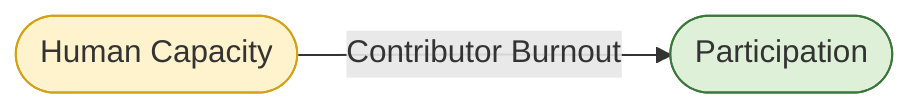
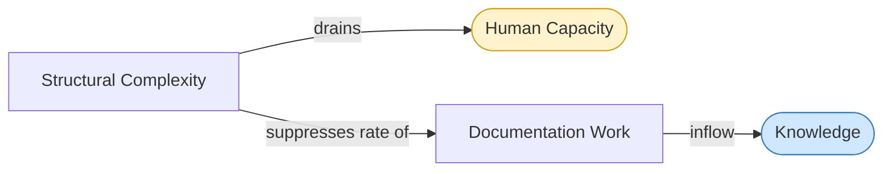

# Flows: Detail

A flow is a rate — the speed at which a stock accumulates or drains over a unit of time. Flows are what change stocks, and flow rates are often the most directly controllable thing in a system. This document does not re-describe what each flow is — that is covered in Stocks Detail. It addresses three things that Stocks Detail does not: what controls flow rates, how delays are embedded in flows rather than just in stocks, and how several flows operate across more than one stock simultaneously.

---

## Rate Controls

A rate control is a structural or organizational condition that determines how fast a flow runs. Meadows identifies rate controls as more powerful intervention points than the flows themselves, because changing the structure that governs a flow is more durable than trying to push the flow directly.

### Documentation Work (Inflow → Knowledge)

**What controls the rate:**

The rate of Documentation Work is controlled by three conditions operating simultaneously. First, contributor availability — how many people have the time and capacity to write, edit, translate, and maintain. This connects directly to the Human Capacity stock: low capacity means low documentation rate regardless of intent. Second, contribution pathway clarity — how easy it is for a willing contributor to know what needs doing, where to start, and how their work fits into the larger structure. Poor contribution pathways waste Human Capacity on orientation rather than output. Third, tooling accessibility — whether the systems used for documentation are themselves accessible, low-friction, and cognitively sustainable. Documentation tools that are complex or exclusionary reduce the rate even when contributors are available and willing.

**Intervention implication:** The highest-leverage rate control here is contribution pathway clarity. It is the multiplier that determines how efficiently available Human Capacity converts into Documentation Work. Improving it costs less than recruiting contributors and produces faster results than tooling changes.

---

### Diverse Perspectives (Inflow → Knowledge)

**What controls the rate:**

This flow's rate is controlled by community breadth — how many distinct communities are actively engaged — and by the depth of their engagement. A system with many nominally connected communities but shallow engagement produces a low rate of Diverse Perspectives inflow. The rate is also controlled by how well the system can integrate perspectives that differ significantly from its existing knowledge base. Systems with rigid standards or homogeneous contributor cultures often receive diverse perspectives but fail to incorporate them, effectively setting this flow rate to zero regardless of community size.

**Intervention implication:** Integration capacity is the rate control most often overlooked. Communities can be invited without their perspectives being genuinely incorporated. The rate of this inflow is determined not just by who is present but by whether the system is structurally capable of learning from difference.

---

### AI-Assisted Synthesis (Inflow → Knowledge)

**What controls the rate:**

Rate is controlled by the quality of human direction — specifically the ability of contributors to identify what needs synthesizing, verify outputs, and integrate results into the existing knowledge structure. Without skilled human direction, AI-assisted synthesis produces high volume at low reliability, which can actually increase the Decay and Obsolescence outflow by introducing inaccurate content that appears authoritative.

**Intervention implication:** This flow is a force multiplier on human judgment, not a substitute for it. Its rate is bounded by the Human Capacity available to direct and verify it. Attempts to increase this flow rate by reducing human oversight typically reduce Knowledge stock quality rather than increasing it.

---

### Decay and Obsolescence (Outflow → Knowledge)

**What controls the rate:**

This outflow runs continuously and cannot be stopped — only offset. Its rate is controlled by how fast the system's context changes (external rate control, largely outside the system's influence) and by maintenance investment (internal rate control). Systems with high maintenance investment slow the decay rate significantly. Systems with no maintenance investment see this outflow run at the full rate of contextual change.

**Intervention implication:** Because this outflow cannot be stopped, the only lever is the Documentation Work inflow. The practical question is not how to stop decay but how to ensure Documentation Work runs faster than decay. Modular infrastructure (B2) is the structural condition that makes this feasible — it allows maintenance to be targeted rather than wholesale, reducing the Human Capacity cost per unit of decay offset.

---

### Cognitive Overload (Outflow → Human Capacity)

**What controls the rate:**

Rate is controlled by interface complexity, documentation quality, standards clarity, and the degree to which the system's design accounts for human cognitive limits. Each of these is a structural feature — meaning its rate control is embedded in design decisions rather than in individual contributor behaviour. A system with high structural complexity produces a high Cognitive Overload outflow regardless of how capable or motivated its contributors are.

**Intervention implication:** This is one of the highest-leverage rate controls in the entire system because it affects the most fundamental stock (Human Capacity) and is almost entirely within the system's control to change. Reducing interface complexity, improving documentation clarity, and enforcing cognitive load standards are direct rate reductions on this outflow.

---

### Unsustainable Pacing (Outflow → Human Capacity)

**What controls the rate:**

Rate is controlled by organizational decisions — scope, deadlines, resourcing, and the degree to which sustainability is treated as a design criterion rather than a nice-to-have. Unlike Cognitive Overload, which is driven by structural complexity, Unsustainable Pacing is driven by planning and governance decisions. It is the outflow most directly addressed by B3 (Sustainable Pacing).

**Intervention implication:** This outflow is unusual in that its rate control is almost entirely organizational rather than technical. Changing it requires governance decisions, not engineering decisions. This makes it both more tractable (no technical complexity) and more resistant (organizational norms are slow to change).

---

### Accessible Entry Points (Inflow → Participation)

**What controls the rate:**

Rate is controlled by the actual accessibility of the system across format, language, cognitive load, and contribution pathway dimensions simultaneously. All four must be adequate for the inflow to run. A system that is linguistically accessible but cognitively overloading will see this inflow rate suppressed by the cognitive load dimension regardless of language coverage. The rate is also controlled by how actively the system works to lower barriers versus assuming interested people will overcome them independently.

**Intervention implication:** The weakest dimension sets the ceiling for this inflow rate. Improving three out of four dimensions produces limited gains if the fourth remains a significant barrier. Assessment of which dimension is currently rate-limiting is more valuable than uniform investment across all four.

---

### Language Coverage (Inflow → Participation)

**What controls the rate:**

Rate is controlled by translation investment, plain language standards, and the structural decision to treat non-dominant languages as first-class infrastructure rather than post-hoc additions. Systems that translate reactively — adding language coverage after content is established in one language — run this inflow at a lower rate than systems that build multilingual structure from the start, because reactive translation always lags behind the primary language and produces coverage gaps that reduce effective accessibility.

**Intervention implication:** The structural decision point is early. Retrofitting language infrastructure into an established monolingual system is significantly more expensive than building it in from the beginning. This is a case where delay in intervention dramatically increases the cost of eventual correction.

---

## Flow Delays

A flow delay is the lag between a change in flow rate and a visible change in stock level. Delays are embedded in flows, not just in stocks, and they are responsible for most of the counterintuitive behaviour systems exhibit — overcorrection, oscillation, and the appearance that interventions are not working when they are simply working slowly.

### Documentation Work → Knowledge (Delay: Medium)

A change in Documentation Work rate takes weeks to months to produce a visible change in Knowledge stock quality. Content must be written, reviewed, integrated, and made accessible before it functions as a Knowledge stock asset. This delay means that investment in documentation appears unproductive in the short term, which creates organizational pressure to reduce it — exactly the wrong response.

### Diverse Perspectives → Knowledge (Delay: Long)

Communities take time to build trust, develop contribution capacity, and integrate their perspectives into existing knowledge structures. A change in community engagement rate may take months to years to produce a measurable shift in Knowledge stock diversity. This is one of the longest delays in the system and one of the most commonly underestimated.

### Accessible Entry Points → Participation (Delay: Medium)

Accessibility improvements take time to reach awareness, build trust, and convert into sustained participation. A newly accessible entry point does not immediately produce a proportional Participation inflow — communities that have previously been excluded need time to discover the change, test whether it is genuine, and invest in engagement. Meadows would identify this as a delay that causes intervention designers to underestimate how much change is needed and to stop improving too soon.

### Cognitive Overload → Human Capacity (Delay: Short to Medium)

This delay is shorter than most — contributors experience cognitive overload in real time, and its effect on capacity is relatively rapid. However, the cumulative effect on Human Capacity (burnout) has a much longer delay. This two-phase delay — fast acute effect, slow cumulative effect — is what makes Cognitive Overload particularly dangerous. The system appears to be managing it until it is not.

### Unsustainable Pacing → Human Capacity (Delay: Long)

This is the most dangerous delay in the system. Unsustainable pacing drains Human Capacity slowly and invisibly. Contributors appear functional — and often report feeling functional — until the stock drops below the critical threshold and burnout occurs. By that point the corrective action required (rest, reduced scope, redistribution of responsibility) is far larger than it would have been if the delay had been shorter and the signal had arrived earlier.

---

## Cross-Stock Flows

Several flows operate simultaneously across more than one stock. These are the connections that make the three stocks an interdependent system rather than three parallel systems. Cross-stock flows are where cascade failures originate — a single flow degrading can drain multiple stocks at once.

### Contributor Burnout (Outflow → Human Capacity AND Outflow → Participation)

Contributor Burnout is named as an outflow from Human Capacity in the Stocks Detail document. It is simultaneously an outflow from Participation — when contributors burn out, they exit the system, reducing the Participation stock directly.

This makes Contributor Burnout a cross-stock flow with a multiplier effect. A single event (a contributor burning out) produces a drain on two stocks simultaneously. At the individual level this is invisible. At the system level, if burnout is occurring across multiple contributors, both stocks are draining in parallel — which is the condition most likely to push the system past both stocks' critical thresholds simultaneously.

**Rate control:** B3 (Sustainable Pacing) is the primary structural governor of this flow. It operates on both stocks through a single mechanism, which makes it unusually high-leverage.

---

### Knowledge Centralization (Outflow → Participation AND Outflow → Knowledge)

Knowledge Centralization drains Participation by making the system feel inaccessible and uninfluenceable to those outside the core group. It simultaneously drains Knowledge by reducing the diversity of perspectives feeding into it — the stock becomes a reflection of a shrinking contributor base rather than a broad community.

This is the only flow in the system that is an outflow from two stocks simultaneously and that each stock's degradation accelerates. As Participation drops, Knowledge centralizes further. As Knowledge centralizes, Participation drops further. This is a reinforcing collapse dynamic — not R1 or R2 running in their virtuous direction but the same feedback structure running in reverse.

**Rate control:** Documentation accessibility and contribution pathway clarity are the primary rate controls. When knowledge is well-documented, accessible, and structured for distributed contribution, centralization is resisted. When it is held informally, undocumented, or structured for gatekeeping, centralization accelerates.

---

### Structural Complexity (Outflow → Human Capacity AND Drag on Knowledge Inflows)

Structural Complexity is listed as an outflow from Human Capacity in the Stocks Detail document. It also operates as a rate suppressor on the Documentation Work inflow to Knowledge — complex, tightly coupled systems are harder to document accurately and harder to maintain, which reduces the rate at which Documentation Work can run even when Human Capacity is available.

This makes Structural Complexity a cross-stock drag: it simultaneously depletes Human Capacity and suppresses the primary inflow to Knowledge. B2 (Modular Infrastructure) is the structural mechanism that reduces this drag — modularity reduces both the Human Capacity cost of operating in the system and the difficulty of producing accurate documentation.

**Rate control:** Infrastructure design decisions. The leverage point is early — architectural decisions made at the beginning of a system's life determine its structural complexity trajectory more than any subsequent intervention.

---

## Summary: Highest-Leverage Rate Controls

Across all flows, these rate controls appear most frequently as determinants of system health:

| Rate Control | Flows Affected | Stocks Affected |
|---|---|---|
| Contribution pathway clarity | Documentation Work ↑ | Knowledge ↑ |
| Sustainable pacing governance | Unsustainable Pacing ↓, Contributor Burnout ↓ | Human Capacity ↑, Participation ↑ |
| Modular infrastructure | Structural Complexity ↓, Targeted Repair ↑, Documentation Work ↑ | Human Capacity ↑, Knowledge ↑ |
| Accessibility across all four dimensions | Accessible Entry Points ↑ | Participation ↑ |
| Integration capacity for diverse perspectives | Diverse Perspectives ↑ | Knowledge ↑ |

These are not the only rate controls in the system. They are the ones that appear across multiple flows and multiple stocks — meaning an intervention at any of these points produces effects that propagate across the system rather than remaining local.

---

*CC BY-SA 4.0 — Christopher Steel*
