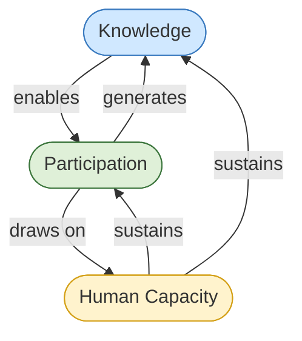
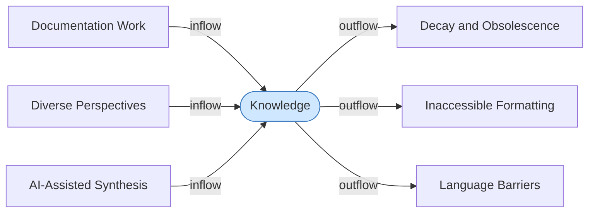
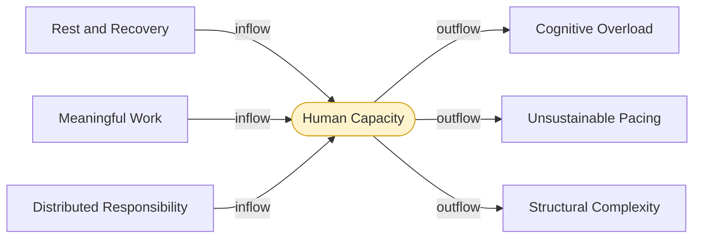
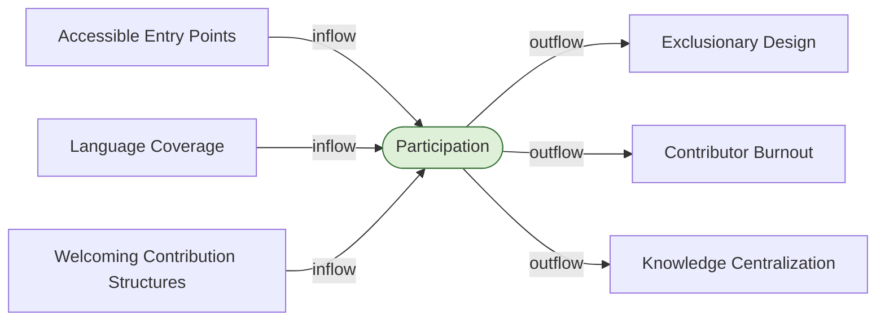

# Stocks: Detail

A stock is an accumulation — something that builds up or drains down over time. Stocks give systems their inertia. They cannot jump instantly to a new level; they change only as fast as their flows allow. This is why systems respond slowly to interventions, and why damage done to a stock is often harder to reverse than it was to cause.

Universal Cake's system contains three primary stocks. Each one is load-bearing across multiple loops. This document describes each stock in terms of its inflows, outflows, delay characteristics, threshold behaviour, and dependencies with the reinforcing and balancing loops.

---

## Stock Map

All three stocks are interdependent. No stock can remain healthy if another collapses.

---

## S1: Knowledge

**What accumulates here:** Documented understanding — written, structured, translated, and accessible. Not raw information. Knowledge in this sense is information that has been made usable by someone other than its original author.

### Inflows

**Documentation work** is the primary inflow. Contributors writing, editing, translating, structuring, and maintaining content. Without this flow, the stock drains toward obsolescence regardless of how much raw information exists in the system.

**Diverse perspectives** is a qualitative inflow from the Language Infrastructure reinforcing loop (R2). Knowledge produced by a narrow contributor base reflects a narrow range of conditions. Each additional community that engages adds test cases, failure modes, and framings the existing knowledge base did not contain. This is not additive — it is multiplicative. Different perspectives interact and produce knowledge neither would generate alone.

**AI-assisted synthesis** is an emerging inflow. AI can accelerate documentation, translation, and knowledge structuring — but only when directed by human judgment. It is a flow amplifier, not a flow source. Without human contributors providing direction and verification, AI-assisted synthesis produces volume without reliability.

### Outflows

**Decay and obsolescence** is a continuous passive outflow. Knowledge that is not maintained becomes inaccurate. Systems change, contexts shift, and undated or unmaintained documentation becomes a liability — it appears authoritative while being wrong. This outflow never stops. It can only be offset by documentation work.

**Inaccessible formatting** is an active outflow that converts existing knowledge into effectively lost knowledge. Content that exists but cannot be read — due to format, cognitive load, or interface — is not a Knowledge stock asset. It is waste. This connects directly to the Accessibility node in R1.

**Language barriers** function the same way as inaccessible formatting but along the language dimension. Knowledge that exists only in one language is inaccessible to communities that do not read that language. This outflow connects directly to the Language Infrastructure node in R2.

### Delay Characteristics

Knowledge has long delay dynamics in both directions. Building a reliable knowledge base takes sustained documentation work over months or years. Losing one also takes time — decay is gradual, and the point at which degraded knowledge begins actively harming the system (by misleading contributors or excluding participants) arrives later than the degradation itself.

This means: knowledge problems are typically well-established before they become visible. Interventions that feel early are usually already late.

### Threshold Behaviour

Below a minimum viable threshold, the Knowledge stock inverts its function. Instead of reducing barriers to participation, degraded knowledge creates them — new contributors must spend more time navigating contradictions, outdated content, and gaps than they would in a system with no documentation at all. This is the point at which documentation debt becomes a net negative on the Participation stock.

### Loop Dependencies

| Loop | Role of Knowledge Stock |
|---|---|
| R1 (Accessibility Reinforcing) | Documentation quality determines whether Accessibility improves or degrades. Knowledge is what documentation work produces and what accessibility delivers to participants. |
| R2 (Language Infrastructure Reinforcing) | Diverse Knowledge is an explicit node in R2. The Knowledge stock is what that node accumulates. |
| B1 (Clear Standards) | Standards exist to prevent the Knowledge stock from fragmenting into inconsistency. Without B1, the stock splits into incoherent sub-stocks that cannot serve each other. |
| B2 (Modular Infrastructure) | Modular infrastructure determines whether Knowledge can be maintained incrementally or only wholesale. Tightly coupled knowledge systems accumulate maintenance debt until the stock must be rebuilt rather than repaired. |

---

## S2: Human Capacity

**What accumulates here:** The energy, attention, motivation, and trust that contributors bring to the system over time. Not a measure of individual talent or effort. A measure of the structural conditions under which people are asked to work.

Human Capacity is the most fundamental stock in the system. Both reinforcing loops and all three balancing loops either draw from it or exist to protect it.

### Inflows

**Rest and recovery** is the biological baseline. Contributors are humans. Their capacity replenishes through rest, adequate time between demands, and work that does not exceed sustainable cognitive limits. Systems that treat rest as optional or unproductive are drawing down this stock without replenishment.

**Meaningful work** is a qualitative inflow that affects how efficiently capacity is used and how quickly it recovers. Contributors doing work they understand to be purposeful and impactful sustain engagement longer and recover faster than those doing work that feels disconnected from outcomes. Universal Cake's emphasis on human agency is operating here — agency is what makes work feel meaningful rather than extractive.

**Distributed responsibility** prevents the stock from draining unevenly. When responsibility is concentrated in a small number of contributors, those contributors' Human Capacity becomes the system's single point of failure. Distributed responsibility ensures that no individual drain rate exceeds what the stock can sustain.

### Outflows

**Cognitive overload** is the primary active outflow. Systems with high interface complexity, poor documentation, inconsistent standards, or inaccessible design force contributors to spend Human Capacity navigating the system rather than contributing to it. This is waste in the Meadows sense — a flow that drains the stock without producing a compensating inflow elsewhere.

**Unsustainable pacing** is a structural outflow driven by organizational decisions. Deadlines, scope, and workload expectations that exceed what contributors can sustain deplete Human Capacity faster than it can replenish. Unlike cognitive overload, this outflow is often invisible to those setting the pace — it appears as productivity until the stock drops below a threshold and burnout occurs.

**Structural complexity** is the accumulated cost of technical debt, unclear standards, and tightly coupled infrastructure. Contributors working in complex, poorly documented, inaccessible systems spend more Human Capacity per unit of output than contributors working in well-maintained, modular, accessible ones. This connects B2 (Modular Infrastructure) directly to the Human Capacity stock — infrastructure decisions are capacity decisions.

### Delay Characteristics

Human Capacity has the longest delay dynamics of the three stocks. Burnout accumulates slowly and often invisibly — contributors appear functional until they do not. Recovery from burnout is slower than its accumulation. A contributor who has burned out may take months to return to full capacity, and some do not return at all.

This makes Human Capacity the stock most likely to be depleted past the point of recovery before the problem is recognized. **Systems optimized for short-term output are particularly prone to this failure mode because the depletion signal arrives after the damage is done**.

### Threshold Behaviour

Below a critical threshold, Human Capacity loss becomes self-accelerating. Fewer contributors means more work per remaining contributor, which drains their capacity faster, which reduces the contributor pool further. This is the reinforcing loop running in collapse — not R1 or R2 driving growth, but the Human Capacity stock driving its own depletion through the same feedback structure.

> **This threshold effect is why Meadows treats stocks with long delay dynamics as high-priority management targets. By the time the threshold crossing is visible, the corrective action required is far larger than it would have been earlier.**

### Loop Dependencies

| Loop | Role of Human Capacity Stock |
|---|---|
| R1 (Accessibility Reinforcing) | Contributors are the mechanism between Participation and Documentation. Without Human Capacity, no documentation work occurs and the loop breaks. |
| R2 (Language Infrastructure Reinforcing) | Community Engagement and the production of Diverse Knowledge both require Human Capacity from the communities doing the work. |
| B1 (Clear Standards) | Corrective Action requires Human Capacity. Without it, drift accumulates without response. |
| B2 (Modular Infrastructure) | Targeted Repair requires Human Capacity. Modular infrastructure reduces the capacity cost of each repair, making the stock go further. |
| B3 (Sustainable Pacing) | B3 exists entirely to protect this stock. Sustainable pacing is the primary structural mechanism for keeping Human Capacity above its critical threshold. |

---

## S3: Participation

**What accumulates here:** The sustained presence and engagement of people in the system — reading, contributing, translating, maintaining, challenging, and using. Participation is not a count of registered users. It is the depth and breadth of active, ongoing engagement across diverse communities.

### Inflows

**Accessible entry points** are the structural conditions that allow new people to enter the system. Format accessibility, plain language, low cognitive barrier onboarding, and clear contribution pathways all function as inflows to Participation. This is the Accessibility node in R1 expressed as a flow.

**Language coverage** is the equivalent inflow along the language dimension. Each additional language in which the system is legible opens a new inflow channel. This is the Language Infrastructure node in R2 expressed as a flow.

**Welcoming contribution structures** are the social and organizational conditions that determine whether people who have entered the system remain and deepen their engagement. Clear standards (B1), distributed responsibility (B3), and modular infrastructure (B2) all contribute here. A system that is technically accessible but organizationally hostile will see high entry rates and high exit rates — a stock that does not build.

### Outflows

**Exclusionary design** is the primary structural outflow. Every interface decision, language assumption, cognitive load increase, or format choice that narrows who can engage drains Participation. This outflow is often unintentional — it is the accumulated effect of design decisions made without considering the full range of people who might need to use the system.

**Contributor burnout** connects the Human Capacity stock directly to the Participation stock as an outflow. When Human Capacity falls below a sustainable level, contributors exit — either by burning out entirely or by reducing their engagement to a level that no longer sustains the loops. This is the primary pathway by which B3 failure damages Participation.

**Knowledge centralization** is a subtler outflow. When knowledge becomes concentrated in a small number of people or locations — because documentation is poor, translation is absent, or contribution pathways are unclear — the system becomes dependent on those people for access. This creates fragility and discourages new participation. Why contribute to a system whose knowledge you cannot access or influence?

### Delay Characteristics

**Participation has medium delay dynamics**. It responds faster than Human Capacity but slower than Knowledge. Communities that disengage do not typically announce their departure — they simply stop appearing. Detecting declining participation requires active measurement, and corrective action (reopening entry points, improving accessibility) takes time to show results because community trust, once lost, rebuilds slowly.

### Threshold Behaviour

Below a minimum viable Participation level, the Knowledge stock loses its diversity inflow and begins to reflect only the perspectives of the remaining contributors. This is the "success to the successful" trap Meadows identifies — the system increasingly optimizes for the narrow group still engaged, which further excludes those who have left, which further narrows the contributor base.

At the extreme, Participation collapses to a core maintainer group whose Human Capacity is then the entire system's load-bearing structure — a single point of failure with no redundancy.

### Loop Dependencies

| Loop | Role of Participation Stock |
|---|---|
| R1 (Accessibility Reinforcing) | Participation is the central stock in R1. It is what Accessibility builds and what Contributors draw from. |
| R2 (Language Infrastructure Reinforcing) | Community Engagement is Participation expressed at the community level. R2 drives Participation inflows from language-diverse communities. |
| B1 (Clear Standards) | Standards reduce the cognitive cost of participation — making the system more legible for existing and new participants. |
| B2 (Modular Infrastructure) | Modular systems are easier to contribute to. Targeted, bounded contribution tasks require less Human Capacity per unit of Participation, lowering the barrier for engagement. |
| B3 (Sustainable Pacing) | Sustainable pacing prevents the Contributor Burnout outflow from draining Participation below its critical threshold. |

---

## Cross-Stock Dependencies

The three stocks are not independent. Each one's health affects the others:

| If this stock degrades | This stock is affected | Via this mechanism |
|---|---|---|
| Knowledge | Participation | Poor documentation raises the cognitive cost of entry, reducing the Accessible Entry Points inflow. |
| Knowledge | Human Capacity | Contributors navigating bad documentation spend more capacity per unit of work, accelerating the Cognitive Overload outflow. |
| Human Capacity | Knowledge | Documentation work stops. The Decay and Obsolescence outflow goes uncompensated. |
| Human Capacity | Participation | Contributors exit. The Contributor Burnout outflow drains Participation directly. |
| Participation | Knowledge | Fewer contributors means fewer documentation inflows and loss of diverse perspective inflows. |
| Participation | Human Capacity | Remaining contributors absorb more responsibility, accelerating the Unsustainable Pacing outflow. |

No stock can be managed in isolation. Interventions targeted at one stock without considering the others will produce the delays, oscillations, and unintended consequences Meadows warns against throughout her work.

---

## Priority Order for Intervention

Based on delay dynamics and threshold behaviour:

**First: Human Capacity.** It has the longest delays, the most severe threshold behaviour, and is the foundation everything else draws from. Protecting it via B3 (Sustainable Pacing) is the highest-leverage structural intervention available. Once depleted past threshold, no other intervention can compensate.

**Second: Participation.** It is the load-bearing stock for both reinforcing loops. Without it, R1 and R2 cannot run in their virtuous direction regardless of Knowledge quality. Entry point accessibility and language coverage are the highest-leverage inflows.

**Third: Knowledge.** It is important but more recoverable than the other two, provided Human Capacity and Participation are intact. A system with healthy contributors and engaged communities can rebuild a degraded Knowledge stock. A system with depleted Human Capacity and collapsed Participation cannot.

---

*CC BY-SA 4.0 — Christopher Steel*
