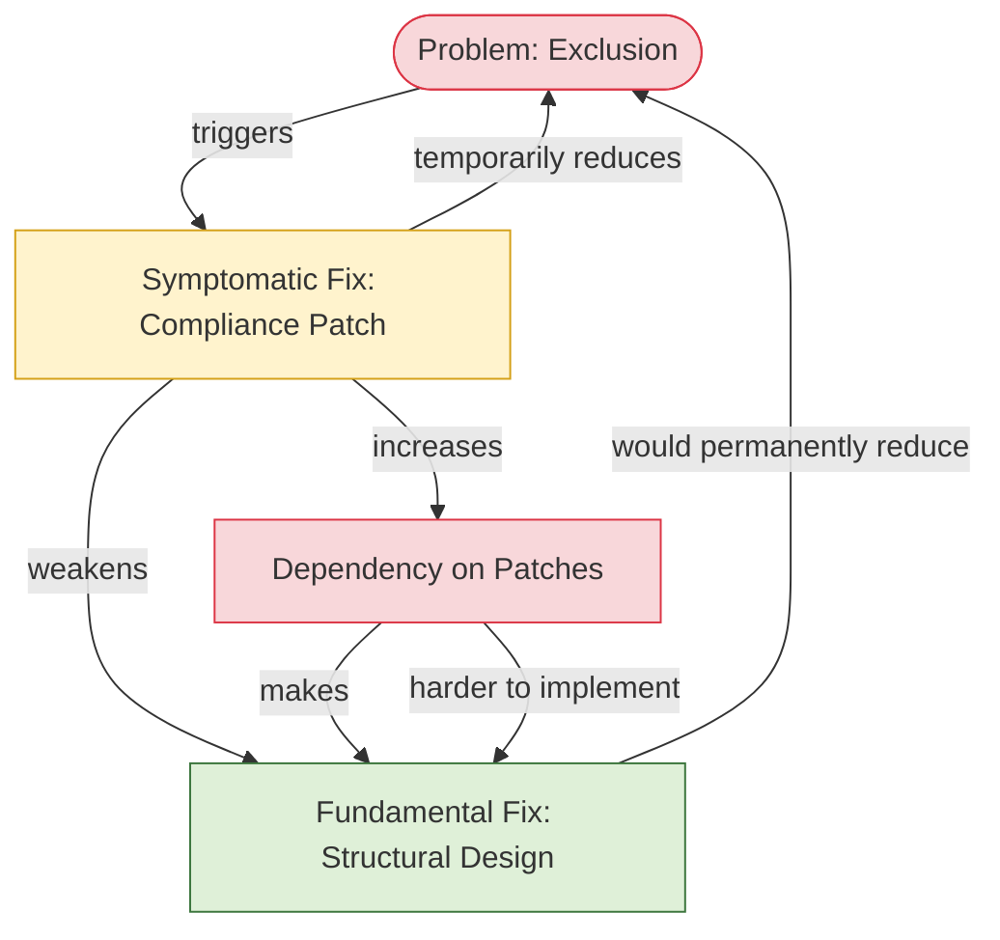
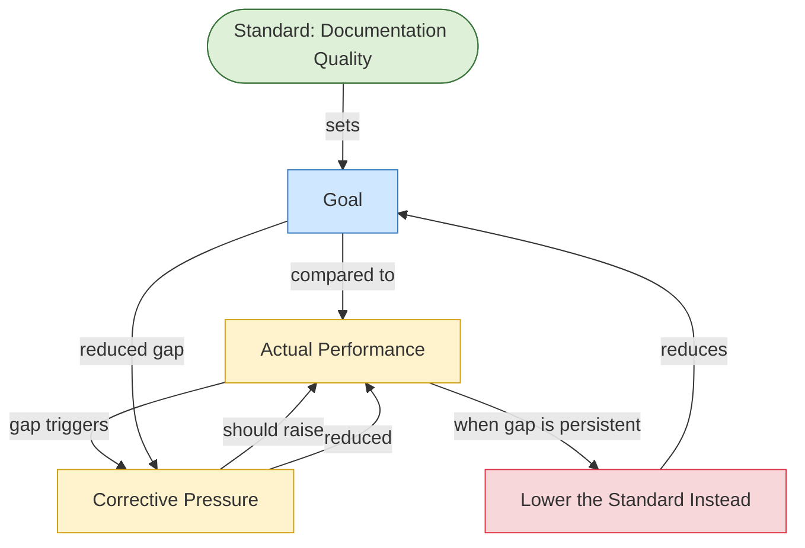
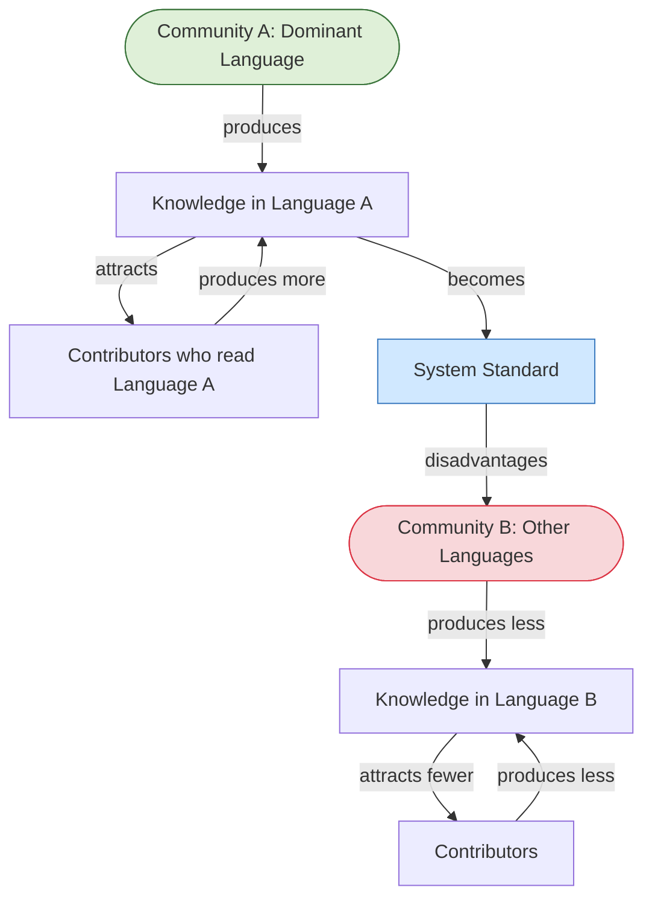
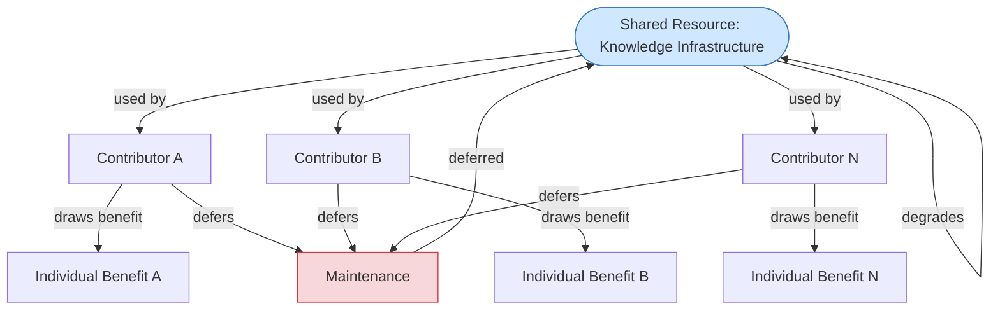

# System Traps: Detail

A system trap is a common feedback structure that reliably produces problematic outcomes regardless of the intentions of the people operating within it. Meadows uses the term "archetype" for these patterns. They recur across domains — economics, ecology, organizations, technology — because they are properties of feedback structure, not of the specific content of any particular system.

Naming a trap is not enough to escape it. Each trap is self-reinforcing: the feedback structure that creates the problem also makes the problem harder to correct. Understanding the mechanism — why the trap persists, what maintains it, what would be required to exit it — is what makes the analysis actionable.

Universal Cake's design principles are, in significant part, structural responses to four traps that conventional technology development consistently falls into. This document describes each trap's mechanism and maps Universal Cake's structural resistance to it.

---

## Trap 1: Shifting the Burden

**In tech:** Treating accessibility as a compliance patch rather than structural design.

### Mechanism

The Shifting the Burden trap activates when a symptomatic fix is easier to reach than a fundamental fix. The symptomatic fix reduces the visible symptom, which reduces pressure to pursue the fundamental fix. Over time, the system's capacity for fundamental fixes atrophies — the people, processes, and organizational will required for structural change are not maintained because the symptom is being managed. The fundamental fix becomes progressively harder to implement, not because it is technically more complex, but because the system has grown dependent on the symptomatic fix and organized itself around managing symptoms rather than addressing causes.

In accessibility terms: a compliance audit produces a punch list of violations. Each violation is patched. The symptom (failed audit) is addressed. The pressure to redesign for accessibility structurally dissipates. The next cycle of development proceeds without accessibility built in, producing the same violations, requiring the same patches. Each cycle makes structural redesign harder — more legacy code, more established patterns, more organizational expectation that accessibility is handled by audits rather than design.

**Why it persists:** The symptomatic fix is faster, cheaper in the short term, and produces a visible result. The fundamental fix requires upfront investment with delayed visible benefit. In organizations that measure short-term output, the trap is almost impossible to avoid without an explicit structural commitment.

**What Universal Cake does:** Treats accessibility as a completion criterion — work is not done unless it is accessible. This removes the choice between symptomatic and fundamental fix by making the fundamental fix the only acceptable path. The trap requires that the symptomatic fix be available as an alternative. Remove the alternative and the trap cannot activate.

---

## Trap 2: Drift to Low Performance

**In tech:** Documentation standards quietly eroding over time.

### Mechanism

The Drift to Low Performance trap activates when a system responds to a gap between actual performance and a standard by lowering the standard rather than raising the performance. This is not usually a conscious decision. It happens through language: "given our constraints," "for now," "we'll come back to this." Each lowering is small and feels reasonable in context. The cumulative effect is a standard that has drifted far below its original level, with no single moment of decision responsible for the distance traveled.

In documentation terms: a project begins with a documentation standard — everything must be written up, accessible, and reviewed before release. Deadline pressure produces the first exception. The exception becomes precedent. The standard is reframed as aspirational. Undocumented releases become normal. Contributors who joined after the standard degraded have no reference for what good documentation looks like. The original standard is no longer the goal; it is a historical artefact.

**Why it persists:** Standards lowering is invisible in the moment and socially frictionless. No one proposes to lower the standard — they propose to make an exception. The trap operates through accumulation of exceptions, not through explicit revision. This is what makes it so difficult to detect and so common.

**What Universal Cake does:** B1 (Clear Standards) is the direct structural response. Standards that are explicit, documented, and treated as system properties rather than team preferences are harder to lower invisibly. The trap requires that lowering be easy and unnoticed. Explicit, versioned standards make lowering a visible, deliberate act rather than a gradual drift.

The balancing loop B1 also creates a corrective signal: when actual performance diverges from the standard, the gap produces visible pressure rather than invisible drift. This is the information flow intervention Meadows identifies as more powerful than parameter adjustments — the system can only correct what it can see.

---

## Trap 3: Success to the Successful

**In tech:** Dominant-language communities accumulating all knowledge and contribution.

### Mechanism

The Success to the Successful trap activates when two actors competing for a shared resource receive advantages proportional to their current success. The initially advantaged actor accumulates more resources, which produces more success, which attracts more resources. The initially disadvantaged actor falls progressively further behind not because of any change in its inherent capacity but because the advantage of the first actor compounds while its own resources decline.

In knowledge infrastructure terms: a system that begins primarily in one language accumulates knowledge, contributors, tooling, and legitimacy in that language. New contributors default to the dominant language because that is where the knowledge is, which produces more knowledge in that language, which further deepens the advantage. Communities in other languages face a system that is progressively harder to enter and contribute to — not because of explicit exclusion but because the resource distribution has compounded against them.

The trap is self-sealing: the dominant community is not doing anything wrong from inside its own experience. The system is working well for them. They have no signal that anything is wrong, because the communities being disadvantaged are not visible within the system they have built.

**Why it persists:** The reinforcing loop that advantages the dominant community is the same structure as R2 (Language Infrastructure Reinforcing) running in its virtuous direction for one community while running in its collapse direction for others. It cannot be broken by appealing to the dominant community's intentions — it requires structural intervention at the resource allocation level.

**What Universal Cake does:** Treats language infrastructure as a first-class system property rather than a secondary accommodation. This is a structural intervention at the resource allocation level — it changes what the system invests in and what counts as a valid contribution, rather than asking the dominant community to be more welcoming. The trap requires that resources compound toward existing advantage. Investing deliberately in language infrastructure for non-dominant communities interrupts the compounding before it becomes irreversible.

---

## Trap 4: Tragedy of the Commons

**In tech:** Shared knowledge infrastructure becoming unmaintainable because maintenance is no one's job.

### Mechanism

The Tragedy of the Commons trap activates when a shared resource is available to multiple actors, each of whom benefits from using it but bears only a fraction of the cost of its depletion. Each individual actor's rational choice — maximize personal benefit, minimize personal maintenance cost — produces a collective outcome that depletes the shared resource to the point of collapse.

In knowledge infrastructure terms: documentation, accessibility standards, translation coverage, and shared tooling are all shared resources. Each contributor benefits from their existence. Each contributor's contribution to maintaining them is small relative to the personal cost of maintenance work. The rational individual choice is to use the shared resource and defer maintenance to others. When all contributors make this choice, the resource degrades — not because anyone chose to degrade it, but because no individual's contribution to maintenance was individually sufficient and no structural mechanism ensured collective maintenance occurred.

This trap is particularly active in open-source and community-driven systems, where the shared resource is abundant enough to use freely but the maintenance responsibility is diffuse enough to be evaded indefinitely.

**Why it persists:** The trap is driven by the structural mismatch between individual benefit (concentrated, immediate) and maintenance cost (diffuse, delayed). No individual actor's decision to maintain changes the outcome unless most actors make the same decision simultaneously. Coordination is required, and coordination has costs. Without a governance mechanism that makes maintenance a structured responsibility rather than a voluntary contribution, the trap runs to depletion.

**What Universal Cake does:** Two structural responses operating at different levels.

First, B2 (Modular Infrastructure) reduces the per-contributor cost of maintenance by making it targeted rather than wholesale. When the cost of each maintenance contribution is lower, more contributors will make it. This does not solve the coordination problem but reduces its severity.

Second — and more fundamentally — treating knowledge infrastructure as a governance concern rather than an individual responsibility. The trap requires that maintenance be optional. Governance structures that make maintenance a structured, resourced, and tracked responsibility — not a voluntary contribution — directly address the coordination failure at the root of the trap. This is the intervention Meadows recommends: restructure the resource access system so that maintenance costs are borne by those who benefit, proportionally and reliably.

---

## Shared Properties of All Four Traps

Each trap has three structural features in common that make it self-reinforcing:

**The feedback structure that creates the problem also makes it harder to correct.** Shifting the Burden weakens the fundamental fix. Drift to Low Performance removes the signal that the standard has dropped. Success to the Successful removes the disadvantaged community from the system that would need to correct for them. Tragedy of the Commons creates a coordination failure that grows harder to solve as the resource degrades.

**The trap operates below the threshold of individual decision-making.** No single person decides to shift the burden, lower the standard, exclude a language community, or let infrastructure degrade. The trap produces these outcomes through accumulated individual decisions that are each locally rational and locally invisible as contributors to the larger pattern.

**Escape requires structural intervention, not behavioral change.** Asking people to try harder, be more accessible, or maintain infrastructure more diligently does not change the feedback structure producing the trap. The trap will reassert itself as long as the structure remains. Universal Cake's responses to each trap are structural — completion criteria, explicit standards, language investment, governance mechanisms — because those are the interventions that change the feedback structure rather than appealing to behavior within an unchanged structure.

---

*CC BY-SA 4.0 — Christopher Steel*
