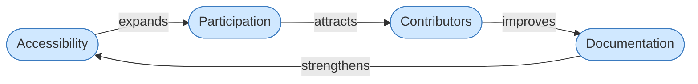

# Loop: Accessibility Reinforcing

A reinforcing loop (R) amplifies change in both directions. This loop grows when any node improves and degrades when any node weakens.

**Loop type:** Reinforcing (R1)
**Direction:** Runs in both directions — virtuous cycle or vicious cycle depending on system health.

---

## Accessibility

Accessibility determines who can enter the system. When language, interface, cognitive load, and format barriers are low, more people can read, understand, and use what the system produces.

Universal Cake treats accessibility not as compliance but as participation infrastructure. A system that excludes people at the door never benefits from what those people would have contributed.

**Meadows framing:** Accessibility is the gate on the inflow to the Participation stock. Tighten the gate and the stock drains. Widen it and the stock builds.

---

## Participation

Participation is the active stock in this loop — the accumulated presence of people engaging with the system over time. It is not a binary (in/out) but a depth measure: how many people, how often, how meaningfully.

When participation is high, the system has more signal, more contributors, and more distributed resilience. When it is low, knowledge centralizes, bottlenecks form, and the system becomes fragile.

**Meadows framing:** Participation is a stock. It builds slowly and drains slowly. Delays here are significant — exclusion today shows up as contributor loss months or years later.

---

## Contributors

Contributors are the people doing active work: writing, translating, maintaining, improving, challenging. They are the mechanism by which participation converts into system output.

More contributors means more perspectives, more maintained components, and less single-point-of-failure risk. Fewer contributors means knowledge silos and burnout for those who remain.

**Meadows framing:** Contributors represent an intermediate flow — they are what participation produces and what documentation requires. If this flow drops, the loop breaks.

---

## Documentation

Documentation is the primary output stock of this loop. It is what makes knowledge persistent, accessible, and reusable. Poor documentation forces every participant to rediscover what already exists. Good documentation lowers the barrier for the next person — which feeds directly back into accessibility.

In Universal Cake, documentation includes not just written text but language coverage, format accessibility, cognitive load, and structural clarity. All of those affect who can enter at the Accessibility node.

**Meadows framing:** Documentation is a stock that decays without active maintenance flows. It also feeds back as a structural input to Accessibility — closing or opening the loop depending on its quality.

---

## Collapse Direction

This loop runs in reverse with equal force:

Inaccessible systems → fewer participants → fewer contributors → degraded documentation → more inaccessible systems.

Most technology systems are experiencing this collapse direction without recognizing it as structural. They attribute declining contribution to individual motivation rather than to the accessibility gate they never opened.

---

*CC BY-SA 4.0 — Christopher Steel*
