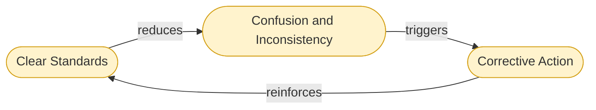
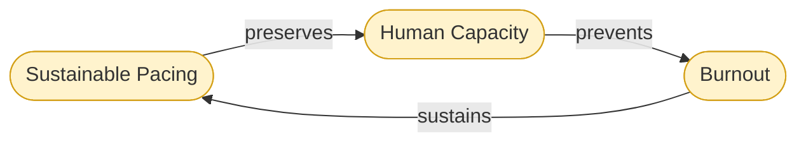

# Loops: Balancing

Balancing loops (B) stabilize systems. They do not amplify — they resist change that moves the system away from a target state. Without balancing loops, the reinforcing loops (R1, R2) would overshoot or collapse. These three loops are the governors.

---

## B1: Clear Standards → Drift Reduction

**Loop type:** Balancing (B1)
**Stabilizes:** Documentation quality, contributor coherence, system-wide legibility.

---

## B2: Modular Infrastructure → Maintenance Accumulation Limit

**Loop type:** Balancing (B2)
**Stabilizes:** Technical debt, infrastructure health, long-term maintainability.

---

## B3: Sustainable Pacing → Burnout Prevention

**Loop type:** Balancing (B3)
**Stabilizes:** Contributor energy, long-term participation, the human stock that both reinforcing loops depend on.

---

## Node Descriptions

### Clear Standards

Clear standards are agreed-upon definitions of what acceptable work looks like — in documentation, accessibility, language, contribution, and design. They are not bureaucratic rules. They are shared references that allow distributed contributors to produce coherent output without requiring constant coordination.

Without clear standards, every contributor makes local decisions. Over time, those decisions accumulate as inconsistency. The system becomes harder to read, maintain, and enter. New contributors face higher barriers. The loop connecting accessibility to participation (R1) begins to weaken.

**Meadows framing:** Standards function as an information flow that tells the system when it has drifted from its target state. Without this information, corrective action cannot happen. Meadows identifies information flows as a high-leverage intervention point — more powerful than tweaking parameters.

---

### Confusion and Inconsistency

Confusion and inconsistency are the outputs of standard degradation. They manifest as: documentation that contradicts itself, interfaces that behave differently across contexts, language that shifts meaning between sections, and accessibility that is uneven across the system.

This is a stock — it accumulates. And like all stocks, it changes slowly. Systems often fail to notice drift until confusion has reached a level where contributors begin to disengage.

**Meadows framing:** This is the gap between the current state and the target state that the balancing loop is trying to close. The larger the gap, the stronger the corrective signal — but only if the signal is visible.

---

### Corrective Action

Corrective action is what happens when confusion becomes visible enough to prompt response: a standards review, a documentation refactor, a style guide update, an accessibility audit. It is the mechanism by which the system returns toward its target state.

Corrective action requires that someone sees the problem, has the capacity to address it, and has the authority or trust to make changes. All three are organizational conditions, not just technical ones.

**Meadows framing:** Corrective action is the balancing response. Its effectiveness depends on the quality of information flow (how clearly drift is visible), the delay before action (how long confusion accumulates before someone responds), and the capacity of contributors (directly connected to B3).

---

### Modular Infrastructure

Modular infrastructure is the structural decision to build systems from separable, independently maintainable components rather than tightly coupled monoliths. When infrastructure is modular, a problem in one area does not propagate across the whole system. Maintenance is localized. Replacement is possible without full rebuilds.

Universal Cake's emphasis on composable infrastructure reflects this directly. Systems that cannot be partially repaired accumulate technical debt until repair requires full replacement — which is the most expensive and disruptive form of maintenance.

**Meadows framing:** Modularity is a structural feature that limits the accumulation rate of the maintenance stock. It does not eliminate maintenance, but it prevents maintenance from becoming catastrophic. It is a structural intervention, which Meadows ranks as more powerful than parameter adjustments.

---

### Maintenance Accumulation

Maintenance accumulation is technical debt — the growing backlog of work required to keep a system functional, accessible, and coherent. It accumulates continuously and invisibly. Like all stocks with delayed consequences, it is easy to ignore until it reaches a threshold where the system begins to fail visibly.

Systems built without modularity accumulate maintenance that cannot be addressed incrementally. The entire system must be frozen or rebuilt. This typically produces the conditions for the reinforcing loops to run in their collapse direction — contributors leave, documentation degrades, and accessibility worsens.

**Meadows framing:** Maintenance accumulation is the stock that B2 is stabilizing. It has a delay between accumulation and visible consequence — one of the most dangerous properties a stock can have, because it allows problems to grow past the point of easy correction before they become apparent.

---

### Targeted Repair

Targeted repair is the ability to address maintenance accumulation in specific, bounded areas without affecting the rest of the system. It is only possible when infrastructure is modular. In a tightly coupled system, targeted repair collapses into systemic intervention — which is too costly to happen regularly.

**Meadows framing:** Targeted repair is the corrective flow in B2. Its effectiveness depends entirely on the modularity of the infrastructure it is acting on. This is why modular infrastructure is the high-leverage node in this loop, not the repair process itself.

---

### Sustainable Pacing

Sustainable pacing is the organizational and structural decision to design work rates that human contributors can maintain over time without depletion. It includes: realistic timelines, adequate rest, distributed responsibility, and systems designed to reduce rather than accumulate cognitive load.

Universal Cake's attention to cognitive sustainability is operating at this node. Cognitive overload is not an individual failure of focus — it is a structural output of systems that do not account for human capacity limits.

**Meadows framing:** Sustainable pacing is a structural input that determines the drain rate on the Human Capacity stock. If pacing exceeds what the stock can sustain, the stock depletes. Once depleted, it recovers slowly — burnout has long delays in both accumulation and recovery.

---

### Human Capacity

Human capacity is the stock of energy, attention, trust, and motivation that contributors bring to the system. It is finite and renewable — but only if the drain rate (pacing) stays within bounds. It is the foundation that both reinforcing loops (R1, R2) depend on. Without human capacity, there are no contributors, no community engagement, no documentation improvement, and no accessibility work.

This is the most fundamental stock in the system. All other loops feed into or draw from it.

**Meadows framing:** Human capacity is a stock with slow dynamics. It builds through rest, meaningful work, and distributed responsibility. It drains through overload, exclusion, and structural misalignment. Because it changes slowly, the delays between causes and effects are long — making it easy to deplete before the problem registers.

---

### Burnout

Burnout is not a personal failure. It is the predictable output of a system that drains Human Capacity faster than it can be replenished. In Universal Cake terms, it is what happens when cognitive load is not reduced, pacing is not sustainable, and contributors are not supported by accessible, modular infrastructure that makes their work tractable.

Burnout is also the point at which this balancing loop connects back to the reinforcing loops in their collapse direction: burned-out contributors leave, participation drops, documentation degrades, and accessibility weakens.

**Meadows framing:** Burnout is the signal that the Human Capacity stock has been drawn below a sustainable level. It is the gap the balancing loop is trying to prevent from opening. Like all such gaps, it is easier to prevent than to close once it has formed.

---

## How the Balancing Loops Relate to the Reinforcing Loops

The three balancing loops (B1, B2, B3) are the conditions under which the reinforcing loops (R1, R2) can run in their virtuous direction. Without:

- B1 (standards), documentation quality drifts and R1 collapses.
- B2 (modularity), technical debt accumulates until R1 and R2 lose their infrastructure.
- B3 (sustainable pacing), human capacity depletes and both reinforcing loops lose their contributors.

The reinforcing loops produce growth. The balancing loops make that growth sustainable.

---

*CC BY-SA 4.0 — Christopher Steel*
