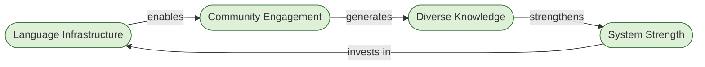

# Loop: Language Infrastructure Reinforcing

A reinforcing loop (R) amplifies change in both directions. This loop grows the more languages and communication structures the system supports, and degrades when language is treated as secondary.

**Loop type:** Reinforcing (R2)
**Direction:** Runs in both directions — virtuous cycle or vicious cycle depending on language investment decisions.

---

## Language Infrastructure

Language infrastructure is the structural layer that determines which communities can communicate within and through a system. It includes translation coverage, plain language standards, multilingual documentation, and the assumptions baked into interfaces about what a "default" user reads and thinks in.

Universal Cake treats language as infrastructure in the same way roads and power grids are infrastructure — not cosmetic, not optional, but load-bearing. If language infrastructure is weak, entire communities are structurally excluded regardless of their willingness to engage.

**Meadows framing:** Language infrastructure is the gate that controls the inflow to Community Engagement. It is also the node where system investment returns — stronger systems can afford better translation, clearer writing, and more language coverage, which re-enters the loop.

---

## Community Engagement

Community engagement is the active participation of distinct communities — defined by language, geography, culture, discipline, or lived experience — in the work of the system. It is not a homogeneous mass of users but a diverse set of groups, each bringing different knowledge, needs, and failure modes.

When language infrastructure is strong, more communities can engage. When it is weak, engagement collapses toward whoever already speaks the dominant language of the system — typically the group that built it.

**Meadows framing:** Community engagement is a stock that accumulates when language gates are open and drains when they close. Like all stocks, it changes slowly — communities that disengage are not quickly recovered.

---

## Diverse Knowledge

Diverse knowledge is what multiple engaged communities generate together. It includes different problem framings, different use cases, different failure modes, different solutions, and different tests of whether the system is actually working for people unlike its builders.

A system with low diversity of knowledge is brittle. It has been tested against a narrow range of conditions. When conditions outside that range emerge — different languages, different abilities, different contexts — the system fails in ways its builders did not anticipate because they never had access to that perspective.

**Meadows framing:** Diverse knowledge is an intermediate output — the productive result of Community Engagement that feeds into System Strength. Without it, the system optimizes against a too-small sample.

---

## System Strength

System strength is the overall resilience, adaptability, and usefulness of the system — its capacity to serve a wide range of people under a wide range of conditions without failing. It is not performance speed or feature count. It is fitness across contexts.

A system that works well for many communities, languages, and ability profiles is a stronger system than one that works perfectly for a narrow group. System strength, in turn, generates the capacity to invest back into language infrastructure — better tooling, more translation, clearer standards.

**Meadows framing:** System strength is both an output of Diverse Knowledge and the source of reinvestment into Language Infrastructure. This is where the loop closes. Systems that become strong by serving many communities can afford to serve even more. Systems that serve few become fragile and have less capacity to expand.

---

## Collapse Direction

This loop runs in reverse with equal force:

Weak language infrastructure → limited community engagement → homogeneous knowledge → fragile system → less investment in language infrastructure.

Most technology systems are in this collapse direction. They launched in one language, optimized for one community, and produced knowledge that reflects only that community's experience. The resulting fragility appears as poor adoption, unexpected failure modes, and inaccessibility — all of which are systemic outputs of the language decision made at the beginning.

---

*CC BY-SA 4.0 — Christopher Steel*
