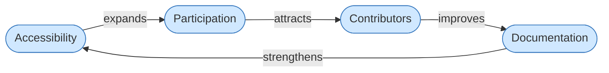
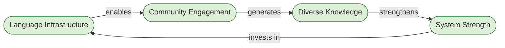
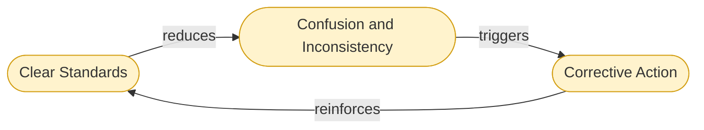
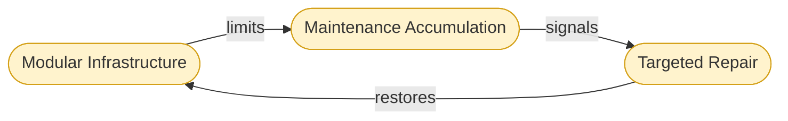
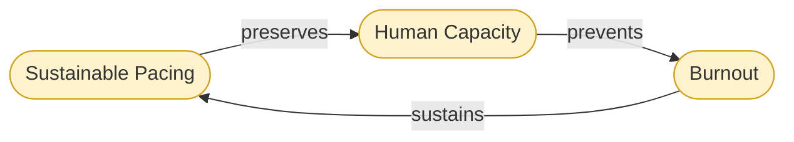

# Universal Cake mapped directly onto Meadows' framework

Here's Universal Cake mapped directly onto Meadows' framework, no padding:

## Overview

**System definition.** Universal Cake is a set of elements (accessibility, language, documentation, cognitive load, AI, governance) connected by interrelationships, organized around the purpose of human agency.

## Stocks overview

**Stocks.** The things Universal Cake accumulates over time:

- Knowledge (documentation quality, accessibility standards, translatable content)
- Human capacity (contributor energy, cognitive bandwidth, trust)
- Participation (who can engage and how fully)

These stocks deplete under inaccessible design, cognitive overload, and exclusionary language. They build under the opposite conditions.

## Flows overview

**Flows.** What adds to or drains those stocks:

| Inflows                      | Outflows            |
| ---------------------------- | ------------------- |
| Accessible documentation     | Cognitive overload  |
| Multilingual infrastructure  | Exclusionary design |
| AI-assisted knowledge work   | Burnout             |
| Inclusive contribution paths | Technical debt      |
| Sustainable pacing           | Knowledge silos     |

------

## Loops overview

### Reinforcing loops (growth or collapse)

**Reinforcing loops (growth or collapse):**

#### Accessibility Loop

Better accessibility ->  wider participation ->  more contributors ->  better documentation ->  better accessibility. This loop runs in both directions. Exclude people and the loop degrades.

#### language Infrastructure Loop

Better language infrastructure ->  more communities can engage ->  more diverse knowledge ->  stronger system ->  better language infrastructure. Same logic.

------

### Balancing loops (stabilizers)

#### Balancing loops (stabilizers)

**Balancing loops (stabilizers):**

Clear standards reduce drift. Modular infrastructure limits maintenance accumulation. Sustainable pacing prevents burnout from draining the human capacity stock. These are the governors that keep reinforcing loops from overshooting or collapsing.

------

**Delays.** The hardest part to manage in Universal Cake's system:

- Inaccessible design causes exclusion that takes years to show up as contributor loss
- Technical debt accumulates invisibly before it collapses a knowledge stock
- Cognitive overload degrades participation before it registers as a problem

Meadows is blunt about delays: they cause people to either under-respond (miss the problem) or over-respond (overshoot). Universal Cake's emphasis on long-term maintainability is essentially delay-awareness baked into design.

------

**System traps Universal Cake is trying to avoid:**

| Trap                      | How it appears in tech                                       |
| ------------------------- | ------------------------------------------------------------ |
| Shifting the burden       | Treating accessibility as a compliance patch rather than structural design |
| Drift to low performance  | Documentation standards quietly eroding over time            |
| Success to the successful | Dominant-language communities accumulating all knowledge and contribution |
| Tragedy of the commons    | Shared knowledge infrastructure becoming unmaintainable because maintenance is no one's job |

------

**Leverage points, ranked weakest to strongest, applied to Universal Cake:**

- **Parameters** (weakest): Font size, translation coverage percentage, response time. Real but shallow.
- **Feedback loops**: Making exclusion visible — who can't access, who dropped out, what knowledge was lost. Without this information, the system can't self-correct.
- **Information flows**: Language as infrastructure is a leverage point here. If people can't read the system, they can't participate in it or improve it.
- **Rules**: What counts as "done"? If accessibility isn't a completion criterion, the system never builds it into its structure.
- **Goals**: Optimizing for speed and throughput produces one system. Optimizing for sustainable human agency produces a different one. This is where Universal Cake most sharply diverges from conventional tech culture.
- **Paradigms** (most powerful): The deepest leverage point is the belief that technology serves people, not the reverse. Universal Cake's canonical sentence — *how the tools we build together can best serve human agency* — is operating at paradigm level. That's why it's harder to change and why it matters more than any individual feature.

------

The Meadows takeaway that fits Universal Cake most cleanly: *systems produce what they are designed to produce.* Burnout, exclusion, and knowledge silos in tech systems are not accidents. They are outputs of systems built without the right stocks, flows, and feedback. Universal Cake is an attempt to redesign those structures at the level that actually changes outcomes.

## Loop Details

### Loop: Accessibility Reinforcing

A reinforcing loop (R) amplifies change in both directions. This loop grows when any node improves and degrades when any node weakens.

**Loop type:** Reinforcing (R1)
**Direction:** Runs in both directions — virtuous cycle or vicious cycle depending on system health.

#### Accessibility

Accessibility determines who can enter the system. When language, interface, cognitive load, and format barriers are low, more people can read, understand, and use what the system produces.

Universal Cake treats accessibility not as compliance but as participation infrastructure. A system that excludes people at the door never benefits from what those people would have contributed.

**Meadows framing:** Accessibility is the gate on the inflow to the Participation stock. Tighten the gate and the stock drains. Widen it and the stock builds.

#### Participation

Participation is the active stock in this loop — the accumulated presence of people engaging with the system over time. It is not a binary (in/out) but a depth measure: how many people, how often, how meaningfully.

When participation is high, the system has more signal, more contributors, and more distributed resilience. When it is low, knowledge centralizes, bottlenecks form, and the system becomes fragile.

**Meadows framing:** Participation is a stock. It builds slowly and drains slowly. Delays here are significant — exclusion today shows up as contributor loss months or years later.

#### Contributors

Contributors are the people doing active work: writing, translating, maintaining, improving, challenging. They are the mechanism by which participation converts into system output.

More contributors means more perspectives, more maintained components, and less single-point-of-failure risk. Fewer contributors means knowledge silos and burnout for those who remain.

**Meadows framing:** Contributors represent an intermediate flow — they are what participation produces and what documentation requires. If this flow drops, the loop breaks.

#### Documentation

Documentation is the primary output stock of this loop. It is what makes knowledge persistent, accessible, and reusable. Poor documentation forces every participant to rediscover what already exists. Good documentation lowers the barrier for the next person — which feeds directly back into accessibility.

In Universal Cake, documentation includes not just written text but language coverage, format accessibility, cognitive load, and structural clarity. All of those affect who can enter at the Accessibility node.

**Meadows framing:** Documentation is a stock that decays without active maintenance flows. It also feeds back as a structural input to Accessibility — closing or opening the loop depending on its quality.

#### Collapse Direction

This loop runs in reverse with equal force:

Inaccessible systems ->  fewer participants ->  fewer contributors ->  degraded documentation ->  more inaccessible systems.

Most technology systems are experiencing this collapse direction without recognizing it as structural. They attribute declining contribution to individual motivation rather than to the accessibility gate they never opened.

###  Loop - Language Infrastructure Reinforcing

A reinforcing loop (R) amplifies change in both directions. This loop grows the more languages and communication structures the system supports, and degrades when language is treated as secondary.

**Loop type:** Reinforcing (R2)
**Direction:** Runs in both directions — virtuous cycle or vicious cycle depending on language investment decisions.

#### Language Infrastructure

Language infrastructure is the structural layer that determines which communities can communicate within and through a system. It includes translation coverage, plain language standards, multilingual documentation, and the assumptions baked into interfaces about what a "default" user reads and thinks in.

Universal Cake treats language as infrastructure in the same way roads and power grids are infrastructure — not cosmetic, not optional, but load-bearing. If language infrastructure is weak, entire communities are structurally excluded regardless of their willingness to engage.

**Meadows framing:** Language infrastructure is the gate that controls the inflow to Community Engagement. It is also the node where system investment returns — stronger systems can afford better translation, clearer writing, and more language coverage, which re-enters the loop.

#### Community Engagement

Community engagement is the active participation of distinct communities — defined by language, geography, culture, discipline, or lived experience — in the work of the system. It is not a homogeneous mass of users but a diverse set of groups, each bringing different knowledge, needs, and failure modes.

When language infrastructure is strong, more communities can engage. When it is weak, engagement collapses toward whoever already speaks the dominant language of the system — typically the group that built it.

**Meadows framing:** Community engagement is a stock that accumulates when language gates are open and drains when they close. Like all stocks, it changes slowly — communities that disengage are not quickly recovered.

#### Diverse Knowledge

Diverse knowledge is what multiple engaged communities generate together. It includes different problem framings, different use cases, different failure modes, different solutions, and different tests of whether the system is actually working for people unlike its builders.

A system with low diversity of knowledge is brittle. It has been tested against a narrow range of conditions. When conditions outside that range emerge — different languages, different abilities, different contexts — the system fails in ways its builders did not anticipate because they never had access to that perspective.

**Meadows framing:** Diverse knowledge is an intermediate output — the productive result of Community Engagement that feeds into System Strength. Without it, the system optimizes against a too-small sample.

#### System Strength

System strength is the overall resilience, adaptability, and usefulness of the system — its capacity to serve a wide range of people under a wide range of conditions without failing. It is not performance speed or feature count. It is fitness across contexts.

A system that works well for many communities, languages, and ability profiles is a stronger system than one that works perfectly for a narrow group. System strength, in turn, generates the capacity to invest back into language infrastructure — better tooling, more translation, clearer standards.

**Meadows framing:** System strength is both an output of Diverse Knowledge and the source of reinvestment into Language Infrastructure. This is where the loop closes. Systems that become strong by serving many communities can afford to serve even more. Systems that serve few become fragile and have less capacity to expand.

#### Collapse Direction

This loop runs in reverse with equal force:

Weak language infrastructure → limited community engagement → homogeneous knowledge → fragile system → less investment in language infrastructure.

Most technology systems are in this collapse direction. They launched in one language, optimized for one community, and produced knowledge that reflects only that community's experience. The resulting fragility appears as poor adoption, unexpected failure modes, and inaccessibility — all of which are systemic outputs of the language decision made at the beginning.

### Loops: Balancing

Balancing loops (B) stabilize systems. They do not amplify — they resist change that moves the system away from a target state. Without balancing loops, the reinforcing loops (R1, R2) would overshoot or collapse. These three loops are the governors.

#### B1: Clear Standards → Drift Reduction

**Loop type:** Balancing (B1)
**Stabilizes:** Documentation quality, contributor coherence, system-wide legibility.

---

#### B2: Modular Infrastructure → Maintenance Accumulation Limit

**Loop type:** Balancing (B2)
**Stabilizes:** Technical debt, infrastructure health, long-term maintainability.

---

#### B3: Sustainable Pacing → Burnout Prevention

**Loop type:** Balancing (B3)
**Stabilizes:** Contributor energy, long-term participation, the human stock that both reinforcing loops depend on.

---

#### Node Descriptions

##### Clear Standards

Clear standards are agreed-upon definitions of what acceptable work looks like — in documentation, accessibility, language, contribution, and design. They are not bureaucratic rules. They are shared references that allow distributed contributors to produce coherent output without requiring constant coordination.

Without clear standards, every contributor makes local decisions. Over time, those decisions accumulate as inconsistency. The system becomes harder to read, maintain, and enter. New contributors face higher barriers. The loop connecting accessibility to participation (R1) begins to weaken.

###### **Meadows framing**

Standards function as an information flow that tells the system when it has drifted from its target state. Without this information, corrective action cannot happen. Meadows identifies information flows as a high-leverage intervention point — more powerful than tweaking parameters.

---

##### Confusion and Inconsistency

Confusion and inconsistency are the outputs of standard degradation. They manifest as: documentation that contradicts itself, interfaces that behave differently across contexts, language that shifts meaning between sections, and accessibility that is uneven across the system.

This is a stock — it accumulates. And like all stocks, it changes slowly. Systems often fail to notice drift until confusion has reached a level where contributors begin to disengage.

###### Meadows framing

This is the gap between the current state and the target state that the balancing loop is trying to close. The larger the gap, the stronger the corrective signal — but only if the signal is visible.

---

##### Corrective Action

Corrective action is what happens when confusion becomes visible enough to prompt response: a standards review, a documentation refactor, a style guide update, an accessibility audit. It is the mechanism by which the system returns toward its target state.

Corrective action requires that someone sees the problem, has the capacity to address it, and has the authority or trust to make changes. All three are organizational conditions, not just technical ones.

###### Meadows framing

Corrective action is the balancing response. Its effectiveness depends on the quality of information flow (how clearly drift is visible), the delay before action (how long confusion accumulates before someone responds), and the capacity of contributors (directly connected to B3).

---

##### Modular Infrastructure

Modular infrastructure is the structural decision to build systems from separable, independently maintainable components rather than tightly coupled monoliths. When infrastructure is modular, a problem in one area does not propagate across the whole system. Maintenance is localized. Replacement is possible without full rebuilds.

Universal Cake's emphasis on composable infrastructure reflects this directly. Systems that cannot be partially repaired accumulate technical debt until repair requires full replacement — which is the most expensive and disruptive form of maintenance.

###### Meadows framing

Modularity is a structural feature that limits the accumulation rate of the maintenance stock. It does not eliminate maintenance, but it prevents maintenance from becoming catastrophic. It is a structural intervention, which Meadows ranks as more powerful than parameter adjustments.

---

##### Maintenance Accumulation

Maintenance accumulation is technical debt — the growing backlog of work required to keep a system functional, accessible, and coherent. It accumulates continuously and invisibly. Like all stocks with delayed consequences, it is easy to ignore until it reaches a threshold where the system begins to fail visibly.

Systems built without modularity accumulate maintenance that cannot be addressed incrementally. The entire system must be frozen or rebuilt. This typically produces the conditions for the reinforcing loops to run in their collapse direction — contributors leave, documentation degrades, and accessibility worsens.

###### Meadows framing

Maintenance accumulation is the stock that B2 is stabilizing. It has a delay between accumulation and visible consequence — one of the most dangerous properties a stock can have, because it allows problems to grow past the point of easy correction before they become apparent.

---

##### Targeted Repair

Targeted repair is the ability to address maintenance accumulation in specific, bounded areas without affecting the rest of the system. It is only possible when infrastructure is modular. In a tightly coupled system, targeted repair collapses into systemic intervention — which is too costly to happen regularly.

###### Meadows framing

Targeted repair is the corrective flow in B2. Its effectiveness depends entirely on the modularity of the infrastructure it is acting on. This is why modular infrastructure is the high-leverage node in this loop, not the repair process itself.

---

##### Sustainable Pacing

Sustainable pacing is the organizational and structural decision to design work rates that human contributors can maintain over time without depletion. It includes: realistic timelines, adequate rest, distributed responsibility, and systems designed to reduce rather than accumulate cognitive load.

Universal Cake's attention to cognitive sustainability is operating at this node. Cognitive overload is not an individual failure of focus — it is a structural output of systems that do not account for human capacity limits.

###### Meadows framing

Sustainable pacing is a structural input that determines the drain rate on the Human Capacity stock. If pacing exceeds what the stock can sustain, the stock depletes. Once depleted, it recovers slowly — burnout has long delays in both accumulation and recovery.

---

##### Human Capacity

Human capacity is the stock of energy, attention, trust, and motivation that contributors bring to the system. It is finite and renewable — but only if the drain rate (pacing) stays within bounds. It is the foundation that both reinforcing loops (R1, R2) depend on. Without human capacity, there are no contributors, no community engagement, no documentation improvement, and no accessibility work.

This is the most fundamental stock in the system. All other loops feed into or draw from it.

###### Meadows framing

Human capacity is a stock with slow dynamics. It builds through rest, meaningful work, and distributed responsibility. It drains through overload, exclusion, and structural misalignment. Because it changes slowly, the delays between causes and effects are long — making it easy to deplete before the problem registers.

---

##### Burnout

Burnout is not a personal failure. It is the predictable output of a system that drains Human Capacity faster than it can be replenished. In Universal Cake terms, it is what happens when cognitive load is not reduced, pacing is not sustainable, and contributors are not supported by accessible, modular infrastructure that makes their work tractable.

Burnout is also the point at which this balancing loop connects back to the reinforcing loops in their collapse direction: burned-out contributors leave, participation drops, documentation degrades, and accessibility weakens.

###### Meadows framing

Burnout is the signal that the Human Capacity stock has been drawn below a sustainable level. It is the gap the balancing loop is trying to prevent from opening. Like all such gaps, it is easier to prevent than to close once it has formed.

##### How the Balancing Loops Relate to the Reinforcing Loops

The three balancing loops (B1, B2, B3) are the conditions under which the reinforcing loops (R1, R2) can run in their virtuous direction. Without:

- B1 (standards), documentation quality drifts and R1 collapses.
- B2 (modularity), technical debt accumulates until R1 and R2 lose their infrastructure.
- B3 (sustainable pacing), human capacity depletes and both reinforcing loops lose their contributors.

The reinforcing loops produce growth. The balancing loops make that growth sustainable.
