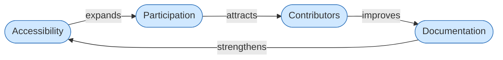

# Universal Cake mapped directly onto Meadows' framework

Here's Universal Cake mapped directly onto Meadows' framework, no padding:

------

## Overview

**System definition.** Universal Cake is a set of elements (accessibility, language, documentation, cognitive load, AI, governance) connected by interrelationships, organized around the purpose of human agency.

------

**Stocks.** The things Universal Cake accumulates over time:

- Knowledge (documentation quality, accessibility standards, translatable content)
- Human capacity (contributor energy, cognitive bandwidth, trust)
- Participation (who can engage and how fully)

These stocks deplete under inaccessible design, cognitive overload, and exclusionary language. They build under the opposite conditions.

------

**Flows.** What adds to or drains those stocks:

| Inflows                      | Outflows            |
| ---------------------------- | ------------------- |
| Accessible documentation     | Cognitive overload  |
| Multilingual infrastructure  | Exclusionary design |
| AI-assisted knowledge work   | Burnout             |
| Inclusive contribution paths | Technical debt      |
| Sustainable pacing           | Knowledge silos     |

------

**Reinforcing loops (growth or collapse):**

Better accessibility → wider participation → more contributors → better documentation → better accessibility. This loop runs in both directions. Exclude people and the loop degrades.

Better language infrastructure → more communities can engage → more diverse knowledge → stronger system → better language infrastructure. Same logic.

------

**Balancing loops (stabilizers):**

Clear standards reduce drift. Modular infrastructure limits maintenance accumulation. Sustainable pacing prevents burnout from draining the human capacity stock. These are the governors that keep reinforcing loops from overshooting or collapsing.

------

**Delays.** The hardest part to manage in Universal Cake's system:

- Inaccessible design causes exclusion that takes years to show up as contributor loss
- Technical debt accumulates invisibly before it collapses a knowledge stock
- Cognitive overload degrades participation before it registers as a problem

Meadows is blunt about delays: they cause people to either under-respond (miss the problem) or over-respond (overshoot). Universal Cake's emphasis on long-term maintainability is essentially delay-awareness baked into design.

------

**System traps Universal Cake is trying to avoid:**

| Trap                      | How it appears in tech                                       |
| ------------------------- | ------------------------------------------------------------ |
| Shifting the burden       | Treating accessibility as a compliance patch rather than structural design |
| Drift to low performance  | Documentation standards quietly eroding over time            |
| Success to the successful | Dominant-language communities accumulating all knowledge and contribution |
| Tragedy of the commons    | Shared knowledge infrastructure becoming unmaintainable because maintenance is no one's job |

------

**Leverage points, ranked weakest to strongest, applied to Universal Cake:**

- **Parameters** (weakest): Font size, translation coverage percentage, response time. Real but shallow.
- **Feedback loops**: Making exclusion visible — who can't access, who dropped out, what knowledge was lost. Without this information, the system can't self-correct.
- **Information flows**: Language as infrastructure is a leverage point here. If people can't read the system, they can't participate in it or improve it.
- **Rules**: What counts as "done"? If accessibility isn't a completion criterion, the system never builds it into its structure.
- **Goals**: Optimizing for speed and throughput produces one system. Optimizing for sustainable human agency produces a different one. This is where Universal Cake most sharply diverges from conventional tech culture.
- **Paradigms** (most powerful): The deepest leverage point is the belief that technology serves people, not the reverse. Universal Cake's canonical sentence — *how the tools we build together can best serve human agency* — is operating at paradigm level. That's why it's harder to change and why it matters more than any individual feature.

------

The Meadows takeaway that fits Universal Cake most cleanly: *systems produce what they are designed to produce.* Burnout, exclusion, and knowledge silos in tech systems are not accidents. They are outputs of systems built without the right stocks, flows, and feedback. Universal Cake is an attempt to redesign those structures at the level that actually changes outcomes.

## Loop Details

### Loop: Accessibility Reinforcing

A reinforcing loop (R) amplifies change in both directions. This loop grows when any node improves and degrades when any node weakens.

**Loop type:** Reinforcing (R1)
**Direction:** Runs in both directions — virtuous cycle or vicious cycle depending on system health.

#### Accessibility

Accessibility determines who can enter the system. When language, interface, cognitive load, and format barriers are low, more people can read, understand, and use what the system produces.

Universal Cake treats accessibility not as compliance but as participation infrastructure. A system that excludes people at the door never benefits from what those people would have contributed.

**Meadows framing:** Accessibility is the gate on the inflow to the Participation stock. Tighten the gate and the stock drains. Widen it and the stock builds.

#### Participation

Participation is the active stock in this loop — the accumulated presence of people engaging with the system over time. It is not a binary (in/out) but a depth measure: how many people, how often, how meaningfully.

When participation is high, the system has more signal, more contributors, and more distributed resilience. When it is low, knowledge centralizes, bottlenecks form, and the system becomes fragile.

**Meadows framing:** Participation is a stock. It builds slowly and drains slowly. Delays here are significant — exclusion today shows up as contributor loss months or years later.

#### Contributors

Contributors are the people doing active work: writing, translating, maintaining, improving, challenging. They are the mechanism by which participation converts into system output.

More contributors means more perspectives, more maintained components, and less single-point-of-failure risk. Fewer contributors means knowledge silos and burnout for those who remain.

**Meadows framing:** Contributors represent an intermediate flow — they are what participation produces and what documentation requires. If this flow drops, the loop breaks.

#### Documentation

Documentation is the primary output stock of this loop. It is what makes knowledge persistent, accessible, and reusable. Poor documentation forces every participant to rediscover what already exists. Good documentation lowers the barrier for the next person — which feeds directly back into accessibility.

In Universal Cake, documentation includes not just written text but language coverage, format accessibility, cognitive load, and structural clarity. All of those affect who can enter at the Accessibility node.

**Meadows framing:** Documentation is a stock that decays without active maintenance flows. It also feeds back as a structural input to Accessibility — closing or opening the loop depending on its quality.

#### Collapse Direction

This loop runs in reverse with equal force:

Inaccessible systems → fewer participants → fewer contributors → degraded documentation → more inaccessible systems.

Most technology systems are experiencing this collapse direction without recognizing it as structural. They attribute declining contribution to individual motivation rather than to the accessibility gate they never opened.

