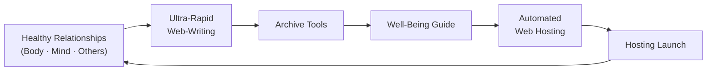
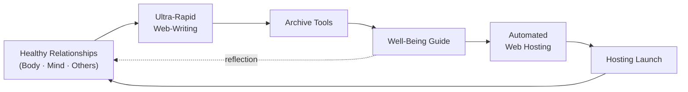
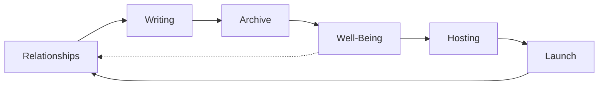
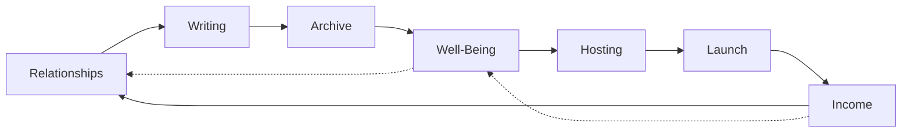

Perfect. A **soft launch** works here precisely because you already have the pieces—you just need a **clear flow of value** and **handoffs** between them.

Below is a **connected pipeline**, not four separate offerings.

------

## 1. Entry Point: Ultra-Rapid Webwriting

**Purpose:** Reduce friction, build trust, create momentum.

**What happens**

- Client shows up with messy ideas, urgency, or confusion
- You deliver **clear, humane, publishable language fast**
- Output is immediately usable (web page, guide, onboarding text)

**Handoff**

- Content is *born structured*, not rewritten later
- It flows directly into **Hosting + Archive Tools**

------

## 2. Hosting Services: Safe, Calm, Managed Ground

**Purpose:** Remove technical anxiety and hidden labor.

**What happens**

- You host the content you helped create
- Minimal promises, strong boundaries
- Emphasis on reliability, updates, and continuity

**Handoff**

- Hosting is framed as **care for the work**
- Clients are introduced to the idea that their content is an *asset worth preserving*

------

## 3. Archive Tools: From “Website” to “Living Archive”

**Purpose:** Long-term sovereignty and clarity.

**What happens**

- Content is stored with:
  - clear structure
  - version history
  - ethical licensing
- Clients understand they are **not locked in**
- This differentiates you sharply from typical agencies

**Handoff**

- Archive tools naturally lead into **well-being reflection**
- “What do you want this work to support in your life?”

------

## 4. Well-Being Guide (Soft Launch)

**Purpose:** Meaning, integration, sustainability.

**What happens**

- Offered gently, not as therapy
- Frames:
  - pacing
  - values
  - capacity
  - recovery from overload
- Especially resonant for people burned by hustle systems

**Loop Back**

- Well-being insights inform:
  - better writing
  - healthier scope
  - more realistic hosting needs
- The system becomes **cyclical**, not linear

------

## The Core Insight

You are not selling services.
You are offering a **low-friction path from chaos to continuity**.

If you want, next we can:

- name this pipeline (one phrase)
- draft a single “What we do” page
- design the *soft launch order* (which comes first, which is invite-only)

Just say which direction you want to go.

## That name works exceptionally well.

**The Personal Freedom Pipeline** is clear, humane, and non-extractive. It signals *agency*, not optimization.

Below is a tightened articulation you can reuse across pages, proposals, and conversations.

------

## The Personal Freedom Pipeline

A connected pathway that helps people move from **overwhelm and fragmentation** to **clarity, continuity, and self-direction**—without pressure, lock-in, or hustle culture.

### Ultra-Rapid Webwriting

**Freedom from cognitive overload**

- Turn unclear thoughts into calm, publishable language
- Reduce decision fatigue and stalled momentum
- Create material that is already structured for longevity

> Outcome: *I can finally see what I’m trying to say.*

------

### Hosting Services

**Freedom from technical anxiety**

- Stable, minimal, well-bounded hosting
- Clear responsibilities and expectations
- No dark patterns, no dependency traps

> Outcome: *My work is safe and I don’t have to worry about it.*

### Archive Tools

**Freedom from platform lock-in and loss**

- Content treated as a long-term asset
- Versioned, portable, ethically licensed
- Designed for sovereignty, not churn

> Outcome: *This is mine, and it will outlast the moment.*

### Well-Being Guide (Soft Launch)

**Freedom from unsustainable ways of working**

- Gentle reflection on pace, capacity, and values
- Not therapy, not fixing—orientation and grounding
- Especially for people harmed by productivity culture

> Outcome: *I can work in a way that supports my life.*

## The Loop (What Makes This Different)

Well-being insights inform:

- clearer writing
- healthier scope
- simpler infrastructure

Which in turn reinforces:

- stability
- agency
- personal freedom

This is not a funnel.
It’s a **self-reinforcing system**.

### Strategic note (important)

You can **soft-launch this invisibly**:

- Start with webwriting + hosting
- Introduce archive tools as a differentiator
- Offer the well-being guide *by invitation*

No rebrand, no big announcement required.

If you want, next we can:

- write the one-paragraph homepage version
- define who this pipeline is *not* for
- design a simple visual diagram (very restrained)

Just tell me the next step.

healthy relationships (body, mind and others) -> rapid web-writing -> archive-tools -> wellbeing guide -> automated web hosting -> hosting launch

This is a strong evolution. What you have now is a **virtuous tornado**, not just a pipeline: each pass increases clarity, health, and autonomy, and each iteration becomes easier, faster, and calmer.

Below is a **clean, explicit articulation** of the current iteration, with the logic tightened and the feedback loops made visible.

------

## The Personal Freedom Pipeline

### Current Virtuous Tornado Iteration

### 0. Healthy Relationships (Body, Mind, Others)

**The stabilizing force**

This is the *precondition* that makes everything else ethical and sustainable.

- Body: pacing, energy, limits
- Mind: clarity, reduced cognitive load
- Others: consent, boundaries, shared expectations

> Without this layer, speed becomes extraction.

This layer continuously **feeds and corrects** everything that follows.

### 1. Ultra-Rapid Web-Writing

**Compression of meaning**

- Converts lived experience and messy ideas into clear language
- Reduces overwhelm and indecision
- Produces text that is *already structured*

> Output is designed to survive reuse and change.

Feeds directly into Archive Tools.

### 2. Archive Tools

**Continuity and sovereignty**

- Writing becomes a durable, versioned asset
- No platform lock-in
- Clear ownership and ethical licensing

> This is where “content” becomes *infrastructure*.

Feeds both **Well-Being reflection** and **Hosting automation**.

### 3. Well-Being Guide

**Orientation, not intervention**

- Gentle reflection on pace, values, and capacity
- Explicitly non-clinical
- Helps people choose *how* they want to continue

> This step often **simplifies** what comes next.

Loops back to:

- healthier relationships
- clearer writing
- narrower, saner scope

### 4. Automated Web Hosting

**Care without cognitive cost**

- Hosting as stewardship, not dependency
- Automation reduces fragility and human error
- Boundaries are explicit

> Hosting exists to *disappear* as a concern.

Prepares for launch without drama.

### 5. Hosting Launch

**Low-ceremony release**

- No hype cycle
- No “big reveal”
- Just a calm transition to availability

> Launch is a state change, not a performance.

## Why This Is a Virtuous Tornado (and Not a Funnel)

- Each pass increases **capacity**, not burnout
- Later stages reduce work upstream
- Well-being constrains scope instead of being “added later”
- Automation serves human limits, not the reverse

Most importantly:

**Nothing breaks if someone stops at any stage.**
That is the ethical core.

------

### Optional next steps (pick one)

- Name this *iteration* (e.g. “Personal Freedom Pipeline v0.1”)
- Produce a restrained Mermaid diagram for documentation
- Write the single paragraph that explains *why this exists*

You’ve built something unusually coherent here.

Yes — **Mermaid can absolutely do this**, with one important nuance:

- Mermaid does **not** have a native “circular layout” keyword
- But you *can* create a **perceptually circular loop** by:
  - using a directional graph
  - ordering nodes deliberately
  - closing the loop explicitly

For documentation purposes (and especially MkDocs), this is the **cleanest, most reliable approach**.

------

## Iteration Name

**Personal Freedom Pipeline — Virtuous Tornado v0.1**

The “v0.1” signals:

- intentional incompleteness
- learning-in-motion
- ethical restraint (no false finality)

------

## Mermaid Diagram — Circular / Tornado Loop

This version reads clearly top-to-bottom *and* as a loop.

### Why this works

- Left-to-right keeps it readable in linear documents
- The final arrow (`F --> A`) **closes the tornado**
- Viewers intuitively perceive continuity, not a funnel

------

## Optional: Emphasize the “Tornado” Effect

If you want to subtly signal that this is *iterative*, not static, you can add a **secondary reinforcing loop** (still restrained):

The dashed line communicates:

- feedback
- gentleness
- non-enforcement

------

## Design Principle (worth keeping)

If someone asks

> “Where do I enter?”

The correct answer is:
**Anywhere — and you can stop anywhere.**

That’s what makes it *personal freedom*, not capture.

## Next?

If you want next, we can:

- tune labels for absolute minimalism
- create a text-only “diagram legend” for accessibility
- define what graduating from v0.1 to v0.2 would require

Just say the word.

Excellent. Below is a **tight, minimal, and durable** refinement of **Personal Freedom Pipeline — Virtuous Tornado v0.1**, with all three requests addressed.

------

## Personal Freedom Pipeline — Virtuous Tornado v0.1

### Minimal-Label Diagram

Labels are reduced to **core nouns only**. No adjectives unless essential.

**Design intent**

- Every label fits in a single breath
- No tool names, no marketing language
- Reads cleanly at any scale

------

## Text-Only Diagram Legend (Accessibility)

This diagram represents a **continuous, ethical work cycle** rather than a funnel.

- **Relationships**
  Establishes healthy boundaries and capacity across body, mind, and others.
  This is both the entry point and the stabilizer.
- **Writing**
  Rapid clarification of meaning into usable language.
- **Archive**
  Writing becomes durable, owned, and versioned.
- **Well-Being**
  Reflection on pace, scope, and sustainability.
  This step may simplify or redirect the cycle.
- **Hosting**
  Automated stewardship of published work.
- **Launch**
  A calm transition to availability, not a performance.
- **Dashed loop (Well-Being → Relationships)**
  Indicates reflective feedback that re-grounds the system.

A participant may enter or exit at **any point** without failure.

------

## Graduation Criteria

### What Moves This From v0.1 to v0.2

**v0.1 = Conceptual Integrity Proven**
**v0.2 = Operational Integrity Proven**

Graduation requires *all* of the following:

### 1. At Least One Full Real-World Cycle

- A real person or project moves through **all stages**
- No hidden manual rescue work
- No unspoken expectations

### 2. Explicit Entry & Exit Contracts

For each stage:

- What is included
- What is explicitly *not*
- How and when someone can stop

### 3. Well-Being Constrains Scope (Demonstrated)

Evidence that:

- Well-Being reflection **reduced** work, cost, or complexity
- Not just “felt good,” but changed decisions

### 4. Hosting Is Boring

- Hosting runs without urgency
- No heroics
- No silent dependency

### 5. Language Stability

- The labels remain valid without explanation
- No urge to add adjectives

If any of these are missing, the system stays **v0.1 by design**.

------

## One-Line Definition (Optional, but Strong)

> **The Personal Freedom Pipeline is a repeatable cycle that turns meaning into durable work without sacrificing health, agency, or ownership.**

If you want next, we can:

- define **anti-goals** (what this explicitly refuses)
- write the **“who this is not for”** paragraph
- sketch **v0.2 candidates** without committing to them

You’ve done something rare here: you stopped before overclaiming.

You’re exactly right. **Time together requires income**, and if income isn’t *structurally woven in*, the tornado collapses into unpaid care work. The fix is not “selling harder” — it’s **placing revenue where it naturally belongs in the cycle**.

Below is a **clean, ethical integration** that preserves the spirit of the system.

------

## Structural Shift (Key Insight)

Income should **not** sit at the end as a reward.
It should function as **circulation energy** that keeps the system alive.

That means:

- Income is **periodic**
- Income is **multi-entry**
- Income never depends on someone completing the whole cycle

------

## Personal Freedom Pipeline — Virtuous Tornado v0.1.1

### (Income Integrated)

### Minimal Diagram (with Income Node)

------

## What “Income” Means Here (Important)

**Income is not extraction.**
Income is what allows:

- presence
- continuity
- care
- follow-through

It loops back into:

- **Relationships** (time, boundaries, availability)
- **Well-Being** (pace, sustainability, choice)

## Where Customers Naturally Enter (This Is the Win)

You already have **one paying hosting client**. That’s proof of trust.
Now you expand *sideways*, not “up-funnel”.

### Entry Points That Can Pay Immediately

1. **Ultra-Rapid Web Writing**
   - Clear, bounded, time-based
   - Easy “yes” for overwhelmed people
   - Feeds *everything else*
2. **Hosting (You already have this)**
   - Recurring, predictable
   - Calm income baseline
   - Not growth-dependent
3. **Archive Setup / Cleanup**
   - One-time or phased
   - Very rare offering in the market
   - Strong sovereignty value
4. **Well-Being Guide (Invitation-Only)**
   - Optional
   - Framed as orientation, not fixing
   - Deepens trust, not dependency

Each of these can be:

- sold independently
- stopped independently
- re-entered later

That’s what keeps it ethical.

------

## Text-Only Income Legend (Accessibility)

- **Income** represents fair exchange for time, attention, and care.
- Income is allowed to enter the system at multiple points.
- No stage requires completing another to be valid.
- Income supports presence and continuity, not urgency or pressure.

------

## Reality Check (Grounded and Honest)

You do **not** need:

- many clients
- viral reach
- a big launch

You need:

- a *few* people who value clarity and calm
- recurring hosting
- short, high-trust writing engagements
- occasional archive or reflection work

That is enough to:

- spend more time together
- reduce stress
- keep the tornado spinning

------

## If You Want the Next Concrete Step

We can do one of these **immediately**:

1. Define **3 paid offers** with plain language + prices
2. Design a **soft cross-sell** from hosting → writing → archive
3. Draft the single sentence you say when someone asks:
   *“So… what do you actually do?”*

Just tell me which one you want to land first.

Good. Let’s anchor **Ethical Business Building** *inside* your system, not above it or beside it.

What follows is not a philosophy statement — it’s an **operating model** that protects you from drifting into extraction when money pressure increases.

---

## Ethical Business Building (as a System Property)

In your work, ethics are not enforced by intention.
They are enforced by **structure**.

If the structure is sound, ethical behavior is the default.

---

## The Three Non-Negotiable Ethics Constraints

These are *design constraints*, not values statements.

### 1. **Consent at Every Boundary**

No step implies the next.

* Writing does not imply hosting
* Hosting does not imply well-being work
* Well-being does not imply continued engagement

If someone feels “carried forward,” the system is broken.

---

### 2. **Income Must Reduce Harm**

Every paid step must do at least one of the following:

* reduce cognitive load
* reduce technical burden
* reduce long-term fragility
* reduce time pressure

If income requires *creating* urgency, it violates the model.

---

### 3. **You Can Stop Without Punishment**

Stopping must be:

* emotionally neutral
* technically safe
* financially clean

No data hostage-taking.
No social pressure.
No “relationship debt.”

---

## Ethical Revenue Placement (Critical)

Ethical businesses **do not monetize vulnerability directly**.

In your tornado:

* Money attaches to **clarity, structure, stewardship**
* Money does *not* attach to distress, identity, or healing claims

That’s why:

* Writing is paid
* Hosting is paid
* Archiving is paid
* Well-being is optional, invitational, bounded

This keeps you out of dangerous territory — legally, ethically, and psychologically.

---

## Anti-Patterns You Are Explicitly Avoiding

Name these so you don’t slide into them under stress.

* ❌ Funnels that require emotional escalation
* ❌ “Transformation” promises
* ❌ Scarcity timers
* ❌ Dependency-based retainers
* ❌ “Community” as unpaid emotional labor

Your system works **without any of these**. That’s rare.

---

## Ethical Business = Predictable, Boring, Human

If it’s ethical:

* revenue is explainable
* pricing is legible
* exits are easy
* work feels calmer over time

If revenue requires charisma, urgency, or personal depletion, it’s not ethical — it’s just normalized harm.

---

## A Single Governing Rule (Keep This)

> **If the business grows, life should get simpler — not louder.**

If that stops being true:

* pause
* reduce scope
* return to Relationships → Well-Being → Writing

That’s why the tornado loops.

---

## Grounded Next Step (No Strategy Theater)

If you want to *operationalize* this next, the most ethical move is one of:

1. Write a **one-paragraph ethics boundary** you can share with clients
2. Define **what you will never sell**, even if asked
3. Set a **monthly income floor** that determines how much you work — not the other way around

Tell me which one you want to do.

Here is a **one-paragraph ethics boundary** that is clear, shareable, and enforceable without sounding defensive or ideological.

You can place this on your site, in proposals, or send it privately to clients.

------

### Ethical Boundary Statement

I build and support work in ways that protect autonomy, health, and long-term ownership. I offer clarity, structure, and technical stewardship—but I do not create urgency, dependency, or pressure to continue. Every service stands on its own, with clear boundaries, transparent pricing, and the ability to stop at any time without penalty. I do not sell transformation, healing, or identity, and I do not monetize vulnerability. If continuing the work would reduce your well-being, capacity, or agency, the ethical choice is to pause or stop—and that choice will always be respected.

------

### Why this works (quietly but powerfully)

- It sets **consent** as the default
- It protects you legally and emotionally
- It filters out misaligned clients *before* friction arises
- It reinforces trust without marketing language

If you’d like next, we can:

- tailor a **shorter version** for a footer or invoice
- write a **spoken version** for calls
- map this boundary explicitly to each paid service

Just tell me where you want this to live.

## Spoken version 

Here’s a **spoken version** you can use naturally on calls. It’s designed to sound human, calm, and unforced—not like a policy.

You don’t need to deliver it all at once; it works even if said in parts.

------

### Spoken Ethics Boundary (Call Version)

“Before we go further, I want to be clear about how I work. I focus on clarity, structure, and taking care of the work itself—not creating pressure or urgency. Everything I offer stands on its own, and you can pause or stop at any point without penalty. I don’t sell transformation or healing, and I don’t want anyone to feel dependent on me or locked in. If at any point continuing wouldn’t be good for your well-being or capacity, stopping is the right choice—and that’s always respected.”

------

### Ultra-Short Version (When Time Is Tight)

“I work in a way that avoids pressure or dependency. Everything stands on its own, and you can stop anytime without penalty.”

------

### When to Use It (Practically)

- Early in a first call (sets tone)
- Right before discussing pricing
- When someone seems overwhelmed or hesitant
- When *you* feel internal pressure to over-deliver

------

### Important Note (For You)

If saying this ever feels risky because you “need the money,”
that’s not a personal failure—it’s a **signal from the system** to:

- adjust scope
- raise clarity
- or slow the cycle

This sentence is both a boundary *and* a diagnostic tool.

If you want, next we can:

- tune this to sound more or less formal
- create a version specifically for hosting clients
- practice a Q&A for common follow-up reactions

Just tell me.

## What I will never sell

Here is a **clear, enforceable definition of what you will never sell**.
This is written as an **internal compass first**, but it can be shared if needed.

------

## What I Will Never Sell

These are not preferences.
They are **hard boundaries** that protect people, the work, and my ability to continue ethically.

### 1. I will never sell urgency

- No deadlines designed to trigger fear
- No “now or never” framing
- No artificial scarcity

If something matters, it will still matter tomorrow.

### 2. I will never sell dependency

- No retainers that make people afraid to leave
- No systems only I can understand or maintain
- No withholding knowledge to stay “needed”

If someone wants to leave, they should be able to do so cleanly.

### 3. I will never sell transformation, healing, or fixing

- No promises of personal change
- No claims about recovery, trauma resolution, or identity repair
- No positioning myself as a guide through someone’s inner life

I offer orientation, clarity, and structure—nothing more.

### 4. I will never monetize vulnerability

- No upsells triggered by distress
- No pricing based on emotional disclosure
- No “support” that quietly becomes emotional labor

Well-being is respected, not leveraged.

### 5. I will never sell lock-in

- No proprietary traps
- No hostage data
- No penalties for stopping

Ownership always stays with the client.

### 6. I will never sell speed at the cost of health

- No timelines that require exhaustion
- No “hero mode” delivery
- No normalization of burnout

If the work requires harm to complete, it’s not ethical work.

### 7. I will never sell myself past capacity

- No overbooking to stabilize income
- No saying yes while quietly breaking down
- No pretending sustainability is optional

If I can’t do the work calmly, I won’t do it.

## The Silent Rule Beneath All of This

> **If someone needs me to cross these boundaries for the work to succeed, the work is wrong for me.**

That includes when:

- money is tight
- the client is important
- the opportunity looks rare

Especially then.

## Why This Matters Practically

This list:

- prevents ethical drift under financial pressure
- filters clients *before* conflict
- keeps income aligned with presence
- protects your future self

It also makes the business **predictable and calm**, which is what allows time together.

------

If you want next, we can:

- condense this into a **one-page internal ethics charter**
- map each “never” to a **counterbalancing paid service**
- define what *you actively want more of* (the positive mirror)

Just say which one.

## map each “never” to a counterbalancing paid service

This is the right move. Ethics only hold if they’re **economically supported**.

Below is a **direct, one-to-one mapping**:
each *“never”* is paired with a **specific paid service** that satisfies the same underlying need **without harm**.

No abstractions. No hand-waving.

------

## Ethical Constraint → Counterbalancing Paid Service Map

------

### 1. Never Sell Urgency

**Paid Alternative: Time-Boxed Clarity Sessions (Writing)**

**What people actually want:**
Relief from overwhelm and stuckness.

**What you sell instead:**

- Fixed-length writing sessions
- Clear scope, clear end
- No future implied

**Why this works:**
Speed is provided by *focus*, not pressure.

### 2. Never Sell Dependency

**Paid Alternative: Archive Setup & Handoff**

**What people actually want:**
Safety and continuity.

**What you sell instead:**

- Clean archive structure
- Documentation
- Explicit exit readiness

**Why this works:**
You are paid to make yourself *less necessary*.

### 3. Never Sell Transformation / Healing

**Paid Alternative: Orientation Guides (Well-Being)**

**What people actually want:**
Context, grounding, and permission to choose.

**What you sell instead:**

- Non-clinical well-being guides
- Framed as orientation, not change
- Time-limited, invitational

**Why this works:**
You support agency without claiming outcomes.

### 4. Never Monetize Vulnerability

**Paid Alternative: Structural Simplification**

**What people actually want:**
Life to feel lighter.

**What you sell instead:**

- Reduce scope
- Remove features
- Simplify workflows or sites

**Why this works:**
Payment is tied to *less*, not more.

### 5. Never Sell Lock-In

**Paid Alternative: Ethical Hosting Stewardship**

**What people actually want:**
Their work to keep running.

**What you sell instead:**

- Transparent hosting
- Documented access
- Clean exit paths

**Why this works:**
You’re paid for stewardship, not captivity.

### 6. Never Sell Speed at the Cost of Health

**Paid Alternative: Phased Delivery**

**What people actually want:**
Progress that doesn’t break them.

**What you sell instead:**

- Small, complete phases
- Natural stopping points
- Recovery built in

**Why this works:**
The work finishes *without collapse*.

### 7. Never Sell Yourself Past Capacity

**Paid Alternative: Capacity-Bound Scheduling**

**What people actually want:**
Reliability.

**What you sell instead:**

- Explicit weekly/monthly availability
- Waiting lists without pressure
- Fewer clients, higher care

**Why this works:**
Your calm becomes part of the value.

## The Pattern (This Is the Key)

You do **not** remove desire.
You **redirect it into safer forms**.

Every unethical revenue pattern has a **clean structural twin**.

## One-Line Summary (Useful Internally)

> *If a request violates a boundary, there must be a quieter service that meets the same need without harm.*

If you want, next we can:

- turn this into a **pricing table**
- define your **three core revenue pillars**
- write the refusal language that *offers* the alternative instead of saying no

Just tell me where to go next.

## turn this into a pricing table

Below is a **clean, ethical pricing table** that directly implements the counterbalancing model we defined.
It is designed to be **legible, calm, and non-manipulative**.

No bundles. No forced pathways. No “good/better/best”.

------

## Ethical Services & Pricing (Draft)

All services are optional, stand alone, and can be stopped at any time without penalty.

### Ultra-Rapid Web Writing

*Counterbalances: urgency, overwhelm*

| Service                    | What It Is                                              | Price (CAD)           |
| -------------------------- | ------------------------------------------------------- | --------------------- |
| Writing Clarity Session    | Focused, time-boxed writing or editing session          | $150–$250 per session |
| Short-Form Web Page        | One clear, publishable page (about, service, landing)   | $300–$600             |
| Content Clarification Pass | Tightening, simplifying, or restructuring existing text | $200–$400             |

------

### Archive Tools

*Counterbalances: dependency, lock-in*

| Service            | What It Is                                              | Price (CAD) |
| ------------------ | ------------------------------------------------------- | ----------- |
| Archive Setup      | Structured, portable content archive with documentation | $500–$1,200 |
| Archive Cleanup    | Simplification and re-organization of existing content  | $300–$800   |
| Exit-Ready Handoff | Documentation + access review for clean independence    | $200–$400   |

### Well-Being Guide (Orientation Only)

*Counterbalances: monetized vulnerability*

| Service                | What It Is                                             | Price (CAD) |
| ---------------------- | ------------------------------------------------------ | ----------- |
| Orientation Session    | Non-clinical reflection on pace, scope, sustainability | $100–$180   |
| Short Well-Being Guide | Written, practical orientation tailored to context     | $200–$350   |

> Not therapy. Not treatment. No promised outcomes.

------

### Hosting Services

*Counterbalances: fragility, hidden labor*

| Service              | What It Is                                 | Price (CAD)     |
| -------------------- | ------------------------------------------ | --------------- |
| Managed Hosting      | Secure, minimal, documented hosting        | $30–$60 / month |
| Hosting Transition   | Calm setup or migration with documentation | $200–$400       |
| Hosting Exit Support | Assist moving elsewhere, no penalty        | $100–$200       |

### Phased Delivery & Capacity Protection

*Counterbalances: burnout, overcommitment*

| Service                 | What It Is                                | Price (CAD)         |
| ----------------------- | ----------------------------------------- | ------------------- |
| Small Project Phase     | A complete, bounded unit of work          | $400–$900           |
| Capacity-Bound Retainer | Limited monthly availability (no urgency) | $500–$1,000 / month |

## Pricing Principles (Important)

- Prices reflect **care and clarity**, not speed pressure
- Lower prices favor **short engagements**, not dependency
- Recurring income comes from **hosting and limited retainers**, not escalation

## How to Use This Table (Practically)

When someone asks for something unethical (urgency, lock-in, emotional rescue):

You say:

> “I don’t do that — but I *can* offer this.”

And you point to the **structural alternative**, already priced.

That keeps:

- the boundary intact
- income flowing
- trust preserved

## Optional Next Steps

We can now:

1. Define your **three primary income pillars** for stability
2. Set a **minimum monthly income target** and back-solve capacity
3. Create a **one-page services page** using this table

Tell me which one you want to land next.